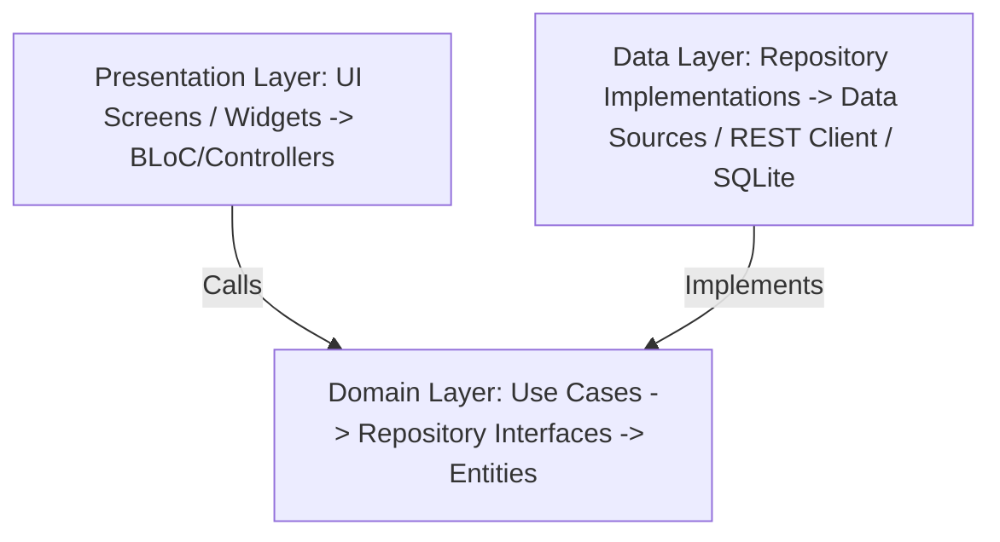
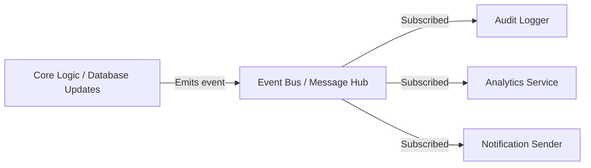

# Architectural Design Document – Leitner Learning Platform

This document defines the architectural patterns, extensibility designs, and structural rules for the mobile application, backend API, and admin panel.

---

## 1. Mobile Feature-Based Clean Architecture

To enforce modularity and ensure that features can be added, updated, or removed with zero side-effects to unrelated domains, the mobile codebase is structured by **independent feature modules** rather than technical layers.

### Directory Structure

```text
lib/
├── app/                  # Application-wide configurations, routing, themes
├── core/                 # Shared utilities, common UI widgets, abstract interfaces
│   ├── network/          # Core HTTP / client configurations
│   ├── error/            # Generic exception and failure definitions
│   └── event_bus/        # Global event bus implementation
└── features/             # Feature-isolated domains
    ├── auth/             # OTP, Accept Rules, and Registration features
    ├── courses/          # Course listing, catalog, downloading, and catalog caching
    ├── flashcards/       # Leitner review loop, study engine UI, card jump, reporting
    ├── settings/         # Theme toggles, font size customization, logout confirmation
    ├── statistics/       # Global/per-course learning progress dashboards
    └── favorites/        # Favorite cards review and management
```

### Layer Separation within Features

Each feature module is split into three clean architectural layers with unidirectional dependencies: `Presentation -> Domain <- Data`.



1.  **Presentation Layer:**
    *   **UI Components:** Flutter widgets and screens representing visual outputs.
    *   **State Management (BLoC/Cubit or Controllers):** Decouples UI states from business triggers. Receives events from the UI and executes use cases, emitting states back to UI widgets.
2.  **Domain Layer (Framework-Independent):**
    *   **Entities:** Core business data models representing domain concepts (e.g., `Course`, `Flashcard`, `LeitnerState`).
    *   **Use Cases (Interactors):** Specific application workflow actions (e.g., `GetDueFlashcards`, `ReviewFlashcard`, `DownloadCourse`).
    *   **Repository Interfaces:** Boundary abstractions defining methods for data retrieval/storage.
3.  **Data Layer:**
    *   **Repository Implementations:** Concretely execute the interfaces defined in the domain layer, coordinating data flow between local storage and remote REST API clients.
    *   **Data Sources:**
        *   *Remote Data Source:* Handles JSON-REST requests using HTTP clients.
        *   *Local Data Source:* Coordinates SQLite queries and encrypted cache access.
    *   **Data Models:** Data contracts handling serialization and deserialization (e.g., `CourseModel.fromJson()`).

---

## 2. Repository Pattern (Mobile)

To prevent UI components from coupling with low-level databases, network clients, or local encryption configurations, all data access occurs via repository interfaces.

```text
[UI View / Controller]
        │ (depends on)
        ▼
[Repository Interface (Domain)]
        ▲
        │ (implements)
[Repository Implementation (Data)]
   ┌────┴────────────────────────┐
   ▼                             ▼
[Remote API Client]      [Local SQLite DB Helper]
```

### Architectural Contract Rules
*   UI files and Use Cases must *never* import database helper packages, execute SQL strings, or instantiate HTTP clients.
*   Data access is completely abstract. For example:
    ```dart
    abstract class CourseRepository {
      Future<Either<Failure, List<Course>>> getCourses();
      Future<Either<Failure, Unit>> downloadCourse(String courseId);
    }
    ```

---

## 3. Pluggable Admin Panel Layout

The React-based Web Admin Panel uses a pluggable layout interface. The main layout console serves as a host that dynamically registers modules.

```text
┌────────────────────────────────────────────────────────┐
│                       Core Admin Shell                 │
├─────────────────┬──────────────────────────────────────┤
│  Sidebar        │  Main Application Viewport           │
│  - Dashboard    │                                      │
│  - Users        │  [Dynamically Mounted Plugs]         │
│  - Courses      │                                      │
│  - Reports      │  Loaded as independent modules       │
│  - Banners      │  via React Router lazy boundaries.   │
│  - Settings     │                                      │
└─────────────────┴──────────────────────────────────────┘
```

### Module Isolation Guidelines
*   Each administrative view (e.g., `UsersManagement`, `CourseManager`, `ReportReviewer`) must be housed in its own subdirectory containing its routes, state, and components.
*   Modules register themselves dynamically to the navigation schema in `src/modules/index.ts`. Adding a module (e.g., `Coupons`) involves adding its descriptor to the routing registry without editing the core header or footer files.
*   All communications with backend services occur via API helper services matching the backend domain modules.

---

## 4. Event-Driven Internal Design

Both frontend (mobile application) and backend utilize an Event Bus system to decouple secondary concerns (logging, achievements, metrics, dynamic push alerts) from core business transactions.



### Core Domain Event Contracts

| Event Name | Source | Payload | Primary Action | Secondary Actions |
| :--- | :--- | :--- | :--- | :--- |
| `PurchaseCompleted` | Backend / Mobile | `userId`, `courseId`, `transactionId`, `price`, `provider` | Unlocks course access in DB | Syncs catalog, sends congratulations push, creates audit trail. |
| `CourseDownloaded` | Mobile | `userId`, `courseId`, `timestamp` | Decrypts & saves SQLite package | Displays success UI, triggers local notifications setup. |
| `CardReviewed` | Mobile | `cardId`, `userId`, `boxFrom`, `boxTo`, `isCorrect` | Updates progression in SQLite | Emits stats updates, checks for achievements. |
| `CardFinished` | Mobile | `cardId`, `userId`, `timestamp` | Moves card to Finished pool | Increments mastery stats. |
| `ReportSubmitted` | Backend / Mobile | `userId`, `courseId`, `cardNumber`, `text` | Saves report entry in DB | Alerts administrators, tags card status in admin panel. |
| `LeitnerProgressReset` | Mobile | `userId`, `cardId`, `reason` (e.g. favorites view, jump by card number) | Resets card state to Box 1 | Records reset action, updates local status bars. |
| `DueDateOverdueReset` | Mobile | `userId`, `cardId`, `dueDate`, `resetDate` | Resets card state to Box 1 | Updates overdue metrics. |

---

## 5. Dependency Injection & Service Abstraction

All third-party services and framework configurations are abstracted behind interfaces. These are registered in a Service Locator (`GetIt` on mobile, native DI container on .NET 8 backend).

### Service Interfaces

#### A. Notification Service
```dart
abstract class NotificationService {
  Future<void> initialize();
  Future<void> scheduleLocalNotification({required String id, required String title, required String body, required DateTime scheduleTime});
  Future<void> cancelNotification(String id);
}
```

#### B. Storage Service (Encrypted local persistence)
```dart
abstract class StorageService {
  Future<void> writeSecure(String key, String value);
  Future<String?> readSecure(String key);
  Future<void> deleteSecure(String key);
}
```

#### C. Encryption Service
```dart
abstract class EncryptionService {
  Future<List<int>> decryptBytes(List<int> encryptedData, List<int> key);
  Future<void> decryptFile(String srcPath, String destPath, List<int> key);
}
```

#### D. Payment Provider (Unified Abstraction)
Provides a generic wrapper around Store APIs (Google Play, Cafe Bazaar, Myket, Direct Portal).
```dart
abstract class PaymentProvider {
  Future<bool> verifyPurchase(String receiptData);
  Future<List<Product>> getCatalog(List<String> productIds);
  Future<PurchaseResult> initiatePurchase(String productId);
}
```

#### E. Feature Flag Service
Handles remote configuration parsing and capability checks.
```dart
abstract class FeatureFlagService {
  Future<void> fetchAndActivate();
  bool isFeatureEnabled(String flagKey);
  String getStringValue(String configKey);
}
```

---

## 6. OS-Independent Execution Policies

To satisfy the requirement that all backend and supporting elements run identically on both Windows Server 2025 and Linux hosts, we enforce strict platform-independent programming standards.

### A. Filesystem Rules
*   **No Hardcoded Backslashes:** Avoid separator assumptions.
*   **Path API Usage:** All operations must construct paths via framework APIs (e.g., `Path.Combine` in .NET, `path.join` in Node.js, `path` package in Flutter).
*   **Case Sensitivity:** Since Linux filesystem routes are case-sensitive while Windows directories are not, all referenced filenames, routes, and imports must match file declarations precisely.

### B. Background Scheduler Strategy
*   **No OS Schedulers:** External schedulers like Windows Task Scheduler or crontabs are strictly forbidden.
*   **Application-Level Jobs:** Background processes (e.g., checking due dates, cleaning temporary files, off-server backup replication runs) must run via **Hangfire** or **Quartz.NET** running inside the container host.

### C. Web Server Deployment
*   Reverse Proxy is standard. **Nginx** handles SSL terminations and proxies requests directly to backend Docker container ports.
*   No features may depend on IIS-specific integrations, Windows Registry API, or Windows native assembly files (`.dll` hooks outside basic cross-platform runtime binaries).
