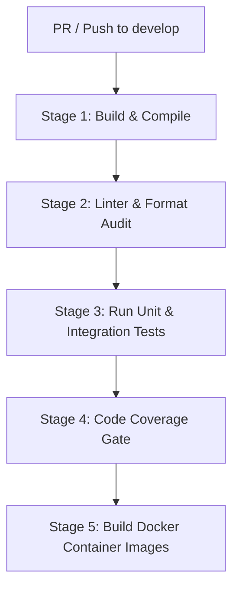

# CI/CD & Testing Standards Specification

This document details the code integration, automated validation pipelines, and testing metrics required to maintain application health throughout the Leitner Learning Platform lifecycle.

---

## 1. Source Control Policies & Branching Model

To ensure code stability and maintain audit trails, the development team follows a strict Git workflow.

```text
  main (protected)  ──────────────────────────────────────────Merge PR
                      ▲                                        │
                      │ (Pull Request & Code Review)           ▼ (Tags)
  develop            ──────────────────────────────────────────Release Candidate
                      ▲
                      │ (Merge Branch)
  feature/*          ───────[Code & Commit Checkpoints]
```

### Git Rules
1.  **Main Branch Protection:** Direct pushes or commits to the `main` branch are blocked. Merges into `main` require a successful Pull Request review, passing build pipelines, and mandatory sign-off.
2.  **Develop Branch:** Houses the integration builds. Feature branches branch off `develop` and are merged back via Pull Requests.
3.  **Feature Branching Nomenclature:** Feature branches are named according to their core system domains (e.g. `feature/auth-otp-integration`, `feature/leitner-logic-rules`).
4.  **Inferred Commit Messages:** Commits must follow clear conventions (e.g., `feat(auth): integrate OTP SMS request API`, `fix(sync): resolve client-progress timestamp comparison conflict`).

---

## 2. Automated CI/CD Pipeline Strategy

The system uses automated pipelines (GitHub Actions / GitLab CI) executing on all code modifications.

### Integration Pipeline Stages



1.  **Stage 1: Build & Compile:**
    *   *Backend:* REST API builds using dotnet CLI (`dotnet build --configuration Release`).
    *   *Admin Panel:* React app compiles using Vite and TypeScript check (`npm run build`).
    *   *Mobile:* Flutter builds verification (`flutter build apk --analyze-size`).
2.  **Stage 2: Linter & Format Audit:** Checks styling rules (Dart analyzer for mobile, dotnet-format for backend, ESLint for admin panel) to prevent style regressions.
3.  **Stage 3: Run Unit & Integration Tests:** Executes all testing suites synchronously.
4.  **Stage 4: Code Coverage Gate:** Verifies coverage metrics. If results fall below threshold boundaries, the pipeline exits with an error status, blockading the merge.
5.  **Stage 5: Build Docker Images:** Compiles backend and admin panel Docker images, outputting artifacts to private image repositories (Docker Hub / GitHub Packages).

---

## 3. Testing Quality Gates & Coverage Metrics

Three distinct testing strategies are implemented to guarantee zero regressions in Leitner algorithms and synchronizations.

### A. Code Coverage Gating (Mandatory Targets)

| Domain | Scope | Target Coverage | Framework |
| :--- | :--- | :---: | :--- |
| **Backend API** | Business controllers, database handlers, sync engines | **Min 80%** | xUnit, EF Core InMemory |
| **Mobile Client** | Core Leitner progression logic, SQLite cache helpers, sync modules | **Min 70%** | Flutter Unit Test, Mockito |
| **Admin Panel** | Core auditing log actions, report panels, config toggles | **Min 60%** | Jest, React Testing Library |

### B. Unit & Integration Testing Guidelines
*   **Leitner Box Timings Scenarios:** Tests must cover 100+ scenario paths checking correct progression intervals (e.g. Box 1 to 2, 2 to 3, incorrect resets back to Box 1, due dates calculations).
*   **Offline Data Merging Scenarios:** Local DB handlers are tested with mocks simulating course database replacement. Assertions check that existing student learning records are preserved.

### C. End-to-End (E2E) Test Suite
The critical paths are validated automatically using E2E browsers and device wrappers.
*   **Admin Console:** Verified using **Playwright** (automating login, manual course activation, banner edits, and checking audit logs table entries).
*   **Mobile App:** Critical user scenarios (OTP auth, downloading a course, performing cards study) are automated and tested using **Appium** on Android emulation environments.
