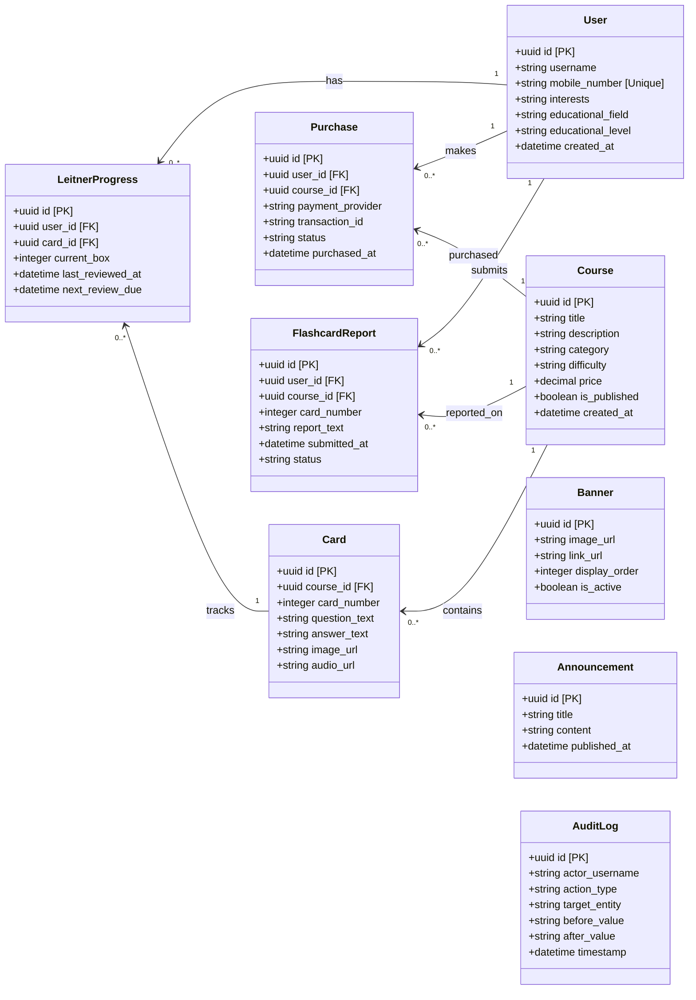
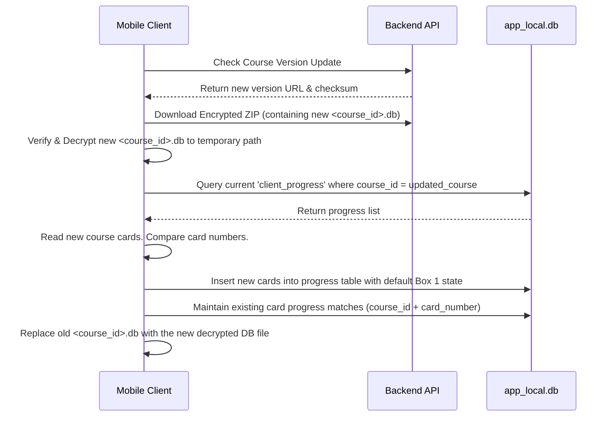

# Database Architecture & Migration Strategy

This document details the database entity models, schemas, and data persistence/migration designs for the server-side database (PostgreSQL 16) and the client-side database (SQLite).

---

## 1. High-Level Entity Relationship Diagram

The following diagram maps out entity fields, constraints, and relationships.



---

## 2. Server Database Schema (PostgreSQL 16)

The production server relational schema is structured with domain separation constraints.

### Tables Definition

#### A. `users`
Stores user profile information. The `mobile_number` serves as the registration key.
```sql
CREATE TABLE users (
    id UUID PRIMARY KEY DEFAULT gen_random_uuid(),
    username VARCHAR(100) NOT NULL,
    mobile_number VARCHAR(15) UNIQUE NOT NULL,
    interests TEXT,
    educational_field VARCHAR(150),
    educational_level VARCHAR(100),
    created_at TIMESTAMP WITH TIME ZONE DEFAULT CURRENT_TIMESTAMP NOT NULL
);
```

#### B. `courses`
Tracks course metadata. The course database package itself is stored as a file link in a media system.
```sql
CREATE TABLE courses (
    id UUID PRIMARY KEY DEFAULT gen_random_uuid(),
    title VARCHAR(200) NOT NULL,
    description TEXT,
    category VARCHAR(100),
    difficulty VARCHAR(50),
    price DECIMAL(12,2) NOT NULL DEFAULT 0.00,
    is_published BOOLEAN NOT NULL DEFAULT false,
    created_at TIMESTAMP WITH TIME ZONE DEFAULT CURRENT_TIMESTAMP NOT NULL
);
```

#### C. `purchases`
Logs course purchases verified against stores (Google Play, Bazaar, Myket, Direct Gateway).
```sql
CREATE TABLE purchases (
    id UUID PRIMARY KEY DEFAULT gen_random_uuid(),
    user_id UUID NOT NULL REFERENCES users(id) ON DELETE CASCADE,
    course_id UUID NOT NULL REFERENCES courses(id) ON DELETE CASCADE,
    payment_provider VARCHAR(50) NOT NULL,
    transaction_id VARCHAR(150) NOT NULL,
    status VARCHAR(50) NOT NULL, -- 'PENDING', 'COMPLETED', 'FAILED', 'REFUNDED'
    purchased_at TIMESTAMP WITH TIME ZONE DEFAULT CURRENT_TIMESTAMP NOT NULL
);
```

#### D. `flashcard_reports`
Stores feedback submitted by users regarding flashcard errors or corrections.
```sql
CREATE TABLE flashcard_reports (
    id UUID PRIMARY KEY DEFAULT gen_random_uuid(),
    user_id UUID NOT NULL REFERENCES users(id) ON DELETE CASCADE,
    course_id UUID NOT NULL REFERENCES courses(id) ON DELETE CASCADE,
    card_number INTEGER NOT NULL,
    report_text TEXT NOT NULL,
    submitted_at TIMESTAMP WITH TIME ZONE DEFAULT CURRENT_TIMESTAMP NOT NULL,
    status VARCHAR(50) NOT NULL DEFAULT 'PENDING' -- 'PENDING', 'REVIEWED', 'RESOLVED'
);
```

#### E. `banners`
Stores dashboard carousel promotional and informational banners.
```sql
CREATE TABLE banners (
    id UUID PRIMARY KEY DEFAULT gen_random_uuid(),
    image_url VARCHAR(512) NOT NULL,
    link_url VARCHAR(512),
    display_order INTEGER NOT NULL DEFAULT 0,
    is_active BOOLEAN NOT NULL DEFAULT true
);
```

#### F. `announcements`
Stores notifications and system-wide announcements.
```sql
CREATE TABLE announcements (
    id UUID PRIMARY KEY DEFAULT gen_random_uuid(),
    title VARCHAR(250) NOT NULL,
    content TEXT NOT NULL,
    published_at TIMESTAMP WITH TIME ZONE DEFAULT CURRENT_TIMESTAMP NOT NULL
);
```

#### G. `audit_logs`
Enforces auditing of all administrative portal modifications.
```sql
CREATE TABLE audit_logs (
    id UUID PRIMARY KEY DEFAULT gen_random_uuid(),
    actor_username VARCHAR(100) NOT NULL,
    action_type VARCHAR(100) NOT NULL, -- 'CREATE_COURSE', 'ACTIVATE_PURCHASE', etc.
    target_entity VARCHAR(100) NOT NULL,
    before_value TEXT,                 -- JSON snapshot of data before change
    after_value TEXT,                  -- JSON snapshot of data after change
    timestamp TIMESTAMP WITH TIME ZONE DEFAULT CURRENT_TIMESTAMP NOT NULL
);
```

---

## 3. Client Database Schema (SQLite)

The mobile client stores data across two local locations:
1.  **Shared App SQLite DB (`app_local.db`):** Tracks user profile, progress, user-created cards, custom notes, and config parameters.
2.  **Course SQLite Packages (`<course_id>.db`):** Read-only packages downloaded from the server, containing flashcards and metadata.

### Shared Local Database Tables (`app_local.db`)

#### A. `client_progress`
Tracks the Leitner state of all cards (including those from downloaded course packages and local user-created cards).
```sql
CREATE TABLE client_progress (
    id TEXT PRIMARY KEY, -- Combines course_id + card_number / card_id
    course_id TEXT NOT NULL,
    card_number INTEGER NOT NULL,
    current_box INTEGER NOT NULL DEFAULT 1, -- Boxes 1 to 5, or 6 (Finished)
    last_reviewed_at TEXT, -- ISO8601 Date
    next_review_due TEXT -- ISO8601 Date
);
CREATE INDEX idx_progress_due ON client_progress(course_id, next_review_due);
```

#### B. `user_created_cards`
Stores flashcards created by the user locally. Protected from server sync.
```sql
CREATE TABLE user_created_cards (
    id INTEGER PRIMARY KEY AUTOINCREMENT,
    course_title TEXT NOT NULL DEFAULT 'My Custom Cards',
    question_text TEXT NOT NULL,
    answer_text TEXT NOT NULL,
    image_path TEXT,
    audio_path TEXT,
    created_at TEXT NOT NULL
);
```

#### C. `favorites`
Stores bookmarks representing favorite cards.
```sql
CREATE TABLE favorites (
    course_id TEXT NOT NULL,
    card_number INTEGER NOT NULL,
    added_at TEXT NOT NULL,
    PRIMARY KEY (course_id, card_number)
);
```

#### D. `settings`
Local configuration preferences.
```sql
CREATE TABLE settings (
    key TEXT PRIMARY KEY,
    value TEXT NOT NULL
);
```

---

## 4. Database Migration & Progress Preservation Strategy

To guarantee that schema additions and data updates are processed correctly, version control migrations are structured for both backend and client environments.

### A. Server Database Migration Framework
*   **Engine:** Managed via `EF Core Migrations` or `Flyway` integration.
*   **Policy:** Raw migrations are versioned sequentially (e.g., `V1__Initial_Schema.sql`, `V2__Add_Audit_Logs.sql`) and stored under the `/deployment/db/migrations` repository. Build agents verify schema migrations automatically against test instances prior to production release.

### B. SQLite Course Sync Merging Strategy
When a course update is pushed from the server (e.g., card edits, typo corrections, additional flashcards), the app downloads a new database package (`<course_id>.db`). To prevent overriding user study states and progress (Leitner boxes, due dates, favorite flags):



1.  **Backup State:** The local database (`app_local.db`) maintains all `client_progress` and `favorites` entries using the stable composite reference (`course_id` + `card_number`).
2.  **Download & Extract:** The new package is downloaded to a temporary directory.
3.  **Merge Data:**
    *   Cards added in the update are inserted into `client_progress` with `current_box = 1` and `next_review_due = immediate`.
    *   Cards deleted in the update are cleaned from `client_progress` and `favorites`.
    *   Cards modified (e.g., text, audio, images) update instantly in the reader view since they reference the newly downloaded package directly. Their `current_box` and schedules inside `app_local.db` remain untouched.
4.  **Replace Package:** The app replaces the old `<course_id>.db` file with the updated database, ensuring zero downtime and 100% preservation of spaced-repetition schedules.
