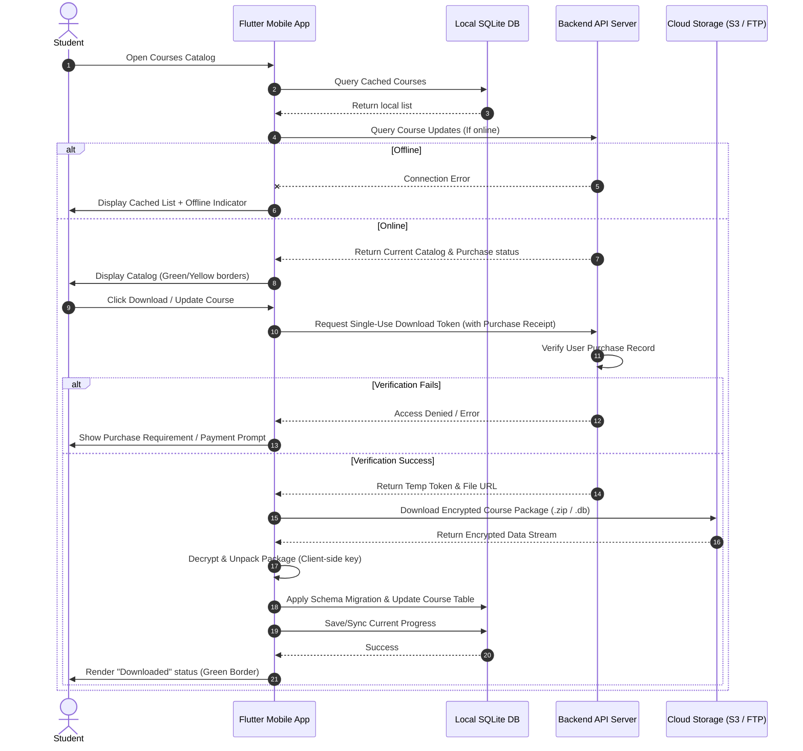

# Offline Synchronization & Storage Architecture

The Leitner Learning Platform is designed around an **offline-first** architecture. Users can study, bookmark, and review flashcards without an active network connection. This document specifies the secure course downloading pipeline, local decryption keys, database synchronization, and offline user interface state rules.

---

## 1. High-Level Sync Workflow

The following sequence maps the sync and download workflow when online and offline.



---

## 2. Secure Course Downloading Pipeline

To prevent unauthorized sharing of premium materials:
1.  **Request Token:** When a user requests a course download, the app requests a single-use token from `/api/v1/courses/{id}/download-token`. The server validates that the user possesses a verified `COMPLETED` purchase record for the target course.
2.  **Generate Link:** The server generates a temporary, cryptographically signed, short-lived download URL pointing to the encrypted course package (valid for 10 minutes).
3.  **Stream Data:** The mobile application streams the package from the storage CDN.
4.  **Local Decryption:** The downloaded file is an encrypted ZIP archive or SQL DB. The app decrypts the file at rest using keys retrieved securely during the authentication phase.

---

## 3. Local Encryption & Security at Rest

All downloaded content is encrypted on the device to prevent content theft.

### A. SQL Database Encryption
*   **Technology:** SQLite databases are encrypted using **SQLCipher** (AES-256 block encryption).
*   **Key Management:** The decryption key is generated dynamically per user during initialization, combined with a salt specific to the installation, and stored in the secure system keychain (iOS Keychain / Android Keystore) via the `StorageService`.

### B. Media Assets Encryption
*   **Location:** Images and audio files are stored in a hidden directory in the application sandbox.
*   **Method:** Files are either:
    1.  Encrypted using AES-256 prior to packaging on the authoring server, and decrypted on-the-fly in RAM inside Flutter before visual rendering (recommended for performance).
    2.  Loaded through custom local HTTP server endpoints inside the app that decrypt media stream chunks dynamically.

---

## 4. Progress Synchronization System

While studies run offline, Leitner states must synchronize with the server backend when internet access is restored.

### A. SQLite Progress State Mapping
*   Local database tracks box indices, reviews, and due times.
*   Whenever a review event occurs (`CardReviewed`), the record is saved to the local `client_progress` table and marked with `is_synced = 0`.

### B. Sync Execution Flow (When Connection Restored)
When the app detects it is back online, it pushes local unsynced states upstream:
1.  **Collect Payload:** Selects all rows in `client_progress` where `is_synced = 0`.
2.  **Push Upstream:** Calls `/api/v1/statistics/sync` sending the payload array:
    ```json
    {
      "sync_time": "2026-06-21T07:52:00Z",
      "progress_deltas": [
        {
          "course_id": "7ac148c2-48df-41c3-88c9-0268ec3ba041",
          "card_number": 42,
          "current_box": 3,
          "last_reviewed_at": "2026-06-21T07:51:30Z",
          "next_review_due": "2026-06-24T07:51:30Z"
        }
      ]
    }
    ```
3.  **Conflict Resolution:** The server compares the `last_reviewed_at` timestamp. The most recent review action always overrides stale data.
4.  **Confirm Sync:** The server responds with success status. The mobile client updates local rows setting `is_synced = 1`.

---

## 5. Offline UI Fallback Requirements

To manage expectations when network states are poor:
*   **Course Catalog Indicator:** If offline, the course lists render from local cache. A clear indicator bar (e.g. at the top of the list) displays: *"Internet connection unavailable; course catalog update not performed."*
*   **Disabled Actions:** Buy buttons and remote update triggers are greyed out, prompting the user with an offline warning message if tapped.
*   **Offline Indicator:** A small status dot or badge appears in the header navigation indicating local database mode is active.
