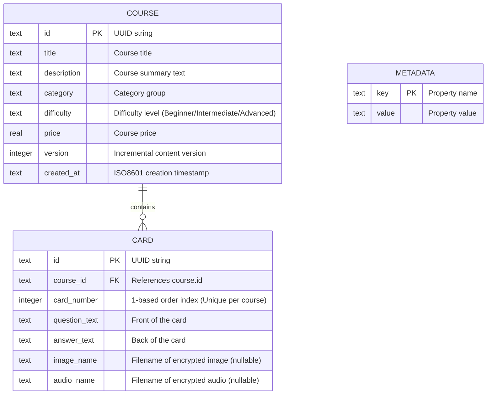
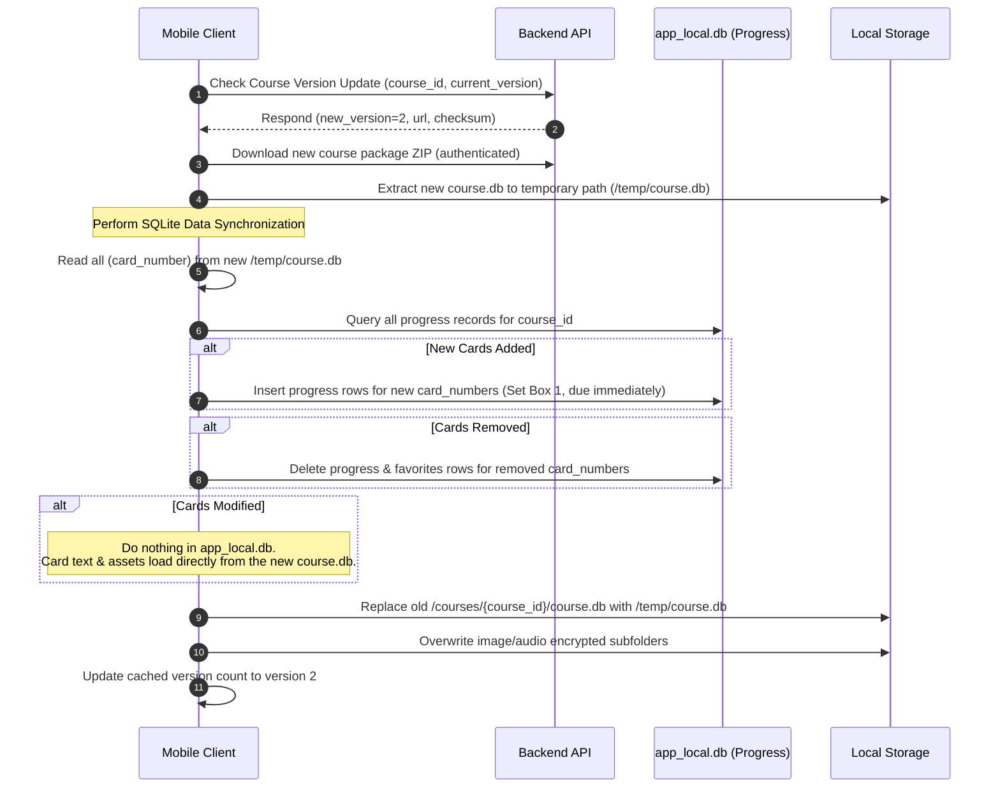

# Course Database Specification

This document defines the data schemas, media format guidelines, content packaging standards, and synchronization/migration strategies for the read-only Course SQLite databases (`<course_id>.db`) used on the Leitner Learning Platform.

---

## 1. Relational SQLite Schema

Each downloaded course package contains a standalone, read-only SQLite database file named `course.db`. This database houses the structural metadata of the course and the complete set of flashcards.



### Table DDL Definitions

#### A. `course`
Stores metadata and details about the specific course in the package.
```sql
CREATE TABLE IF NOT EXISTS course (
    id TEXT PRIMARY KEY,
    title TEXT NOT NULL,
    description TEXT,
    category TEXT,
    difficulty TEXT,
    price REAL NOT NULL DEFAULT 0.0,
    version INTEGER NOT NULL DEFAULT 1,
    created_at TEXT NOT NULL
);
```

#### B. `cards`
Stores the set of cards associated with the course. Cards are referenced sequentially by `card_number` to maintain a stable, human-readable index for bookmarks, progress tracking, and client-server sync.
```sql
CREATE TABLE IF NOT EXISTS cards (
    id TEXT PRIMARY KEY,
    course_id TEXT NOT NULL,
    card_number INTEGER NOT NULL,
    question_text TEXT NOT NULL,
    answer_text TEXT NOT NULL,
    image_name TEXT,
    audio_name TEXT,
    FOREIGN KEY (course_id) REFERENCES course(id) ON DELETE CASCADE
);

-- Index card_number per course to speed up retrieval and state matching
CREATE UNIQUE INDEX IF NOT EXISTS idx_cards_course_number ON cards (course_id, card_number);
```

#### C. `metadata`
Key-value storage for package metadata (e.g. content checksums, packaging tools, compatibility hashes).
```sql
CREATE TABLE IF NOT EXISTS metadata (
    key TEXT PRIMARY KEY,
    value TEXT NOT NULL
);
```

---

## 2. Course Packaging Format

A packaged course is distributed as a ZIP archive named `<course_id>.zip` and extracts into the following directory layout:

```text
course_package/
├── course.db          # SQLCipher encrypted SQLite database (AES-256)
├── manifest.json      # Metadata descriptor (plaintext)
├── images/            # Directory containing encrypted card images
│   ├── img_card_1.webp.enc
│   └── img_card_2.webp.enc
└── audio/             # Directory containing encrypted card pronunciation audio
    ├── aud_card_1.mp3.enc
    └── aud_card_2.mp3.enc
```

### Manifest File Schema (`manifest.json`)
The `manifest.json` file resides at the root of the ZIP file to allow the client and backend to check package metadata without opening the SQLite database.

```json
{
  "course_id": "7ac148c2-48df-41c3-88c9-0268ec3ba041",
  "title": "Comprehensive IELTS Vocabulary",
  "category": "Languages",
  "difficulty": "Advanced",
  "price": 490000.0,
  "version": 3,
  "card_count": 520,
  "created_at": "2026-06-21T08:09:12Z",
  "db_checksum_sha256": "4a7f058d83921db33f6a27e3d8542c222ffda845df0e599cf3a893425cb48ef8"
}
```

---

## 3. Media & Content Guidelines

To maintain visual fluidness, prevent performance latency on entry-level mobile devices, and minimize dynamic bandwidth costs, all authoring content must adhere to these standards:

### Image Asset Standards
*   **Format:** WebP is preferred for high quality and minimal file size. JPEG/PNG are accepted fallbacks.
*   **Dimensions:** Maximum width of $1080\text{px}$, height of $800\text{px}$. Aspect ratios should ideally fit standard card display zones ($4:3$ or $16:9$).
*   **File Size:** Recommended maximum size per image is $150\text{KB}$.
*   **Naming Convention:** Unique per course package: `img_{course_id}_{card_number}.webp`.

### Audio Asset Standards
*   **Format:** Mono MP3 or AAC.
*   **Bitrate:** Standard $64\text{kbps}$ to $96\text{kbps}$ mono is sufficient for speech pronunciation cards.
*   **Sample Rate:** $24\text{kHz}$ or $44.1\text{kHz}$.
*   **Naming Convention:** Unique per course package: `aud_{course_id}_{card_number}.mp3`.

### Media Assets Security & Encryption
All media files inside the `images/` and `audio/` directories of the ZIP package are encrypted individually.
*   **Algorithm:** **AES-256-CBC** (Cipher Block Chaining).
*   **Padding:** PKCS7 padding.
*   **Initialization Vector (IV):** A unique, cryptographically random 16-byte IV is generated for each file. The IV is prepended to the encrypted file bytes during packaging:
    $$\text{Payload} = \text{IV (16 bytes)} \mathbin{\Vert} \text{AES-Encrypt}(\text{RawFileBytes}, \text{CourseKey}, \text{IV})$$
*   **Decryption:** The client reads the first 16 bytes as the IV, and decrypts the remaining payload using the Course Key retrieved during user authorization.

---

## 4. Schema Migration & Progress Preservation Strategy

When content authors release corrections, typo fixes, or new flashcards, the content version increments (e.g. from version `1` to `2`). The backend makes the new `<course_id>.zip` package available.

To download and apply this update on the user's mobile app **without disrupting their current Leitner box progression or favorited bookmarks**, the following sync merge process is executed:

### A. Core Architectural Design
The mobile app keeps all study states (Leitner boxes 1–5, finished tags, next review times) in its global **`app_local.db`** file in the `client_progress` and `favorites` tables. These tables reference the course cards using a composite key:
*   `course_id` (e.g., `"7ac148c2-48df-41c3-88c9-0268ec3ba041"`)
*   `card_number` (e.g., `42`)

Because user statistics are not stored in the read-only `course.db` file, replacing the `course.db` file does not delete user statistics.

### B. Update & Merge Algorithm



1.  **Read Target Identifiers:** The client extracts the updated `course.db` to a temporary workspace and runs a quick query to extract the list of valid `card_number`s.
2.  **Compare and Align:**
    *   **Inserts:** For any `card_number` present in the new database but missing from `app_local.db`'s `client_progress` table, a new entry is generated with default values:
        *   `current_box` = `1`
        *   `last_reviewed_at` = `NULL`
        *   `next_review_due` = `now` (ISO8601 timestamp)
    *   **Deletes:** For any `card_number` missing from the new database but present in `app_local.db`'s `client_progress` or `favorites` tables, the stale rows are deleted.
    *   **Edits:** If a card's question, answer, or media paths were altered, the user's progress is preserved. The next time the card is rendered, the app queries the new `course.db` for the text, loading updated content automatically.
3.  **Swap Files:** The old `course.db` and its encrypted folders are swapped out for the new files, completing the update cycle safely.
