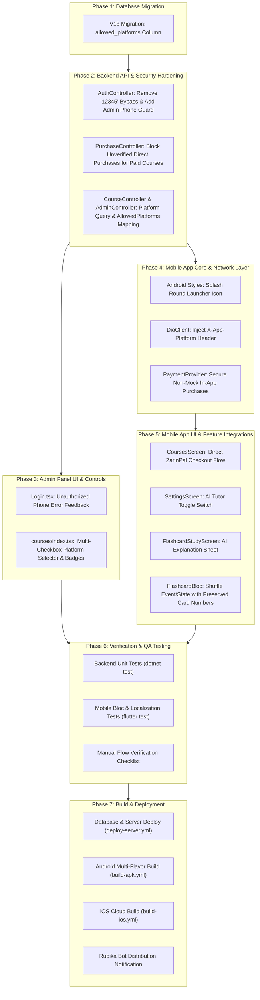

# Comprehensive Roadmap: Resolution of Audit Issues (۱۳ شهریور)

This document provides an actionable, step-by-step technical roadmap to address, resolve, test, and deploy fixes for all 7 issues identified in the audit document (`docs/ایرادات ۱۳ شهریور.PDF`), based on the official [Implementation Plan](file:///e:/projects/leitner_app/docs/implementation_plan.md).

---

## Executive Summary & Issue Matrix

| # | Issue Key | Affected Layer | Severity | Status | Primary Objective |
|---|-----------|----------------|----------|--------|-------------------|
| **1** | `ISSUE-SPLASH-ICON` | Mobile App (`android/res`) | Medium | Ready | Unify splash screen adaptive round icon across `premium` (ZarinPal) and `bazaar` flavors. |
| **2** | `ISSUE-FREE-DOWNLOAD-EXPLOIT` | Backend (`PurchaseController`) & Mobile (`PaymentProvider`) | Critical | Ready | Eliminate mock auto-completion; strictly enforce server-verified purchases before unlocking paid courses. |
| **3** | `ISSUE-COURSE-PLATFORM-FILTER` | Database, Backend, Admin Panel, Mobile App | High | Ready | Introduce multi-platform distribution targeting (`allowed_platforms`) per course/package. |
| **4** | `ISSUE-OTP-BYPASS-ADMIN-SECURITY` | Backend (`AuthController`) & Admin Panel (`Login.tsx`) | Critical | Ready | Permanently delete the `12345` OTP backdoor and restrict admin panel access strictly to authorized owner phone lines. |
| **5** | `ISSUE-AI-TUTOR-USER-CONTROL` | Mobile App (`Settings`, `FlashcardStudyScreen`) | Medium | Ready | Expose user-facing AI Tutor toggle in settings and integrate on-demand AI smart explanations during flashcard study. |
| **6** | `ISSUE-DIRECT-PAYMENT-CHOOSER` | Mobile App (`courses_screen.dart`) | Medium | Ready | Eliminate the store-selector bottom sheet in `premium`/direct flavor and launch ZarinPal gateway directly. |
| **7** | `ISSUE-FLASHCARD-SHUFFLE` | Mobile App (`FlashcardBloc`, `FlashcardStudyScreen`) | Low | Ready | Provide a shuffle toggle during study that randomizes card order while preserving card numbers intact. |

---

## Architecture & Phased Dependency Workflow

To ensure stability, zero regressions, and smooth deployments, implementation must follow this strict dependency sequence:



---

## Detailed Step-by-Step Implementation Roadmap

### Phase 1: Database Migration & Schema Expansion

#### Step 1.1: Create Migration `V18__Add_Course_Allowed_Platforms.sql`
- **Target File**: [`deployment/db/migrations/V18__Add_Course_Allowed_Platforms.sql`](file:///e:/projects/leitner_app/deployment/db/migrations/V18__Add_Course_Allowed_Platforms.sql)
- **Actions**:
  1. Add column `allowed_platforms VARCHAR(255) DEFAULT 'zarinpal,bazaar,myket,googleplay,ios'` to the `courses` table if it does not already exist.
  2. Populate existing records with default all-platform access (`'zarinpal,bazaar,myket,googleplay,ios'`) so existing courses remain published across all targets.
- **Verification**:
  - Run SQL script against test PostgreSQL instance or execute migration via Flyway/Docker.
  - Verify `SELECT id, title, allowed_platforms FROM courses LIMIT 5;` returns default platforms.

---

### Phase 2: Backend API & Security Hardening

#### Step 2.1: Enforce Course Entity and DbContext Mapping
- **Target Files**:
  - [`backend/LeitnerPlatform.Core/Entities/Course.cs`](file:///e:/projects/leitner_app/backend/LeitnerPlatform.Core/Entities/Course.cs)
  - [`backend/LeitnerPlatform.Data/LeitnerDbContext.cs`](file:///e:/projects/leitner_app/backend/LeitnerPlatform.Data/LeitnerDbContext.cs)
- **Actions**:
  1. Add property `public string AllowedPlatforms { get; set; } = "zarinpal,bazaar,myket,googleplay,ios";` to `Course.cs`.
  2. Map property `AllowedPlatforms` to database column `allowed_platforms` with default value in `LeitnerDbContext.cs`.

#### Step 2.2: Hardening OTP Verification & Owner Admin Line Restriction (`Issue 4`)
- **Target Files**:
  - [`backend/LeitnerPlatform.API/Controllers/v1/AuthController.cs`](file:///e:/projects/leitner_app/backend/LeitnerPlatform.API/Controllers/v1/AuthController.cs)
  - [`backend/LeitnerPlatform.API/appsettings.json`](file:///e:/projects/leitner_app/backend/LeitnerPlatform.API/appsettings.json)
  - [`.env`](file:///e:/projects/leitner_app/.env) & [`.env.example`](file:///e:/projects/leitner_app/.env.example)
- **Actions**:
  1. **Remove OTP bypass**: Completely remove `bool isBypass = input.OtpCode == "12345";` from `AuthController.cs`.
  2. Ensure OTP verification unconditionally validates input against cached OTP in Redis (or in-memory cache fallback) with standard TTL.
  3. Add configuration entry `AdminSecurity:AllowedMobileNumbers` / `ADMIN_ALLOWED_MOBILE_NUMBERS` containing authorized owner phone numbers (e.g., `+989120000000,09120000000,...`).
  4. Implement `IsAllowedAdminMobile(string mobile)` helper that normalizes country codes and checks against authorized whitelist.
  5. In `VerifyOtp`:
     - If `input.IsAdminLogin` is true and mobile is NOT whitelisted, immediately return `401 Unauthorized` with error code `UNAUTHORIZED_ADMIN_MOBILE`.
     - In JWT token generation, only issue role `Admin` if `user.IsAdmin && IsAllowedAdminMobile(user.MobileNumber)`. Non-whitelisted users remain `Student`.

#### Step 2.3: Eliminate Free Download Vulnerability for Paid Courses (`Issue 2`)
- **Target File**:
  - [`backend/LeitnerPlatform.API/Controllers/v1/PurchaseController.cs`](file:///e:/projects/leitner_app/backend/LeitnerPlatform.API/Controllers/v1/PurchaseController.cs)
- **Actions**:
  1. In `POST api/v1/purchases` and `POST api/v1/purchases/package`:
     - Reject simulated mock transactions (`mock-*`, `fake-*`) with `400 Bad Request`.
     - Guard against client-driven auto-completion: If `course.Price > 0` or `package.Price > 0`, do NOT allow client to self-report `Status = COMPLETED` directly via standard endpoint.
     - Enforce that purchases for paid items can only transition to `COMPLETED` through verified gateway callbacks (`zarinpal/callback`) or verified server-side IAB validation.
  2. For free courses (`Price == 0`), allow direct enrollment.

#### Step 2.4: Implement Catalog Platform Filtering (`Issue 3`)
- **Target Files**:
  - [`backend/LeitnerPlatform.API/Controllers/v1/CourseController.cs`](file:///e:/projects/leitner_app/backend/LeitnerPlatform.API/Controllers/v1/CourseController.cs)
  - [`backend/LeitnerPlatform.API/Controllers/v1/AdminController.cs`](file:///e:/projects/leitner_app/backend/LeitnerPlatform.API/Controllers/v1/AdminController.cs)
- **Actions**:
  1. In `CourseController.GetCourses`:
     - Extract client target platform from `[FromQuery] string? platform` or `X-App-Platform` header.
     - Filter catalog: Include courses where `allowed_platforms` contains target platform (mapping `premium` and `direct` to `zarinpal`). Always retain already purchased courses for the user.
     - Include `allowed_platforms` in the response payload.
  2. In `AdminController`:
     - Update course creation, package upload, and update endpoints to accept and persist `allowed_platforms`.
     - Return `allowed_platforms` in admin course listings.

---

### Phase 3: Admin Panel UI & Security Integration

#### Step 3.1: Admin Panel Unauthorized Phone Feedback (`Issue 4`)
- **Target Files**:
  - [`admin-panel/src/components/Login.tsx`](file:///e:/projects/leitner_app/admin-panel/src/components/Login.tsx)
  - [`admin-panel/src/locales/fa.json`](file:///e:/projects/leitner_app/admin-panel/src/locales/fa.json)
  - [`admin-panel/src/locales/en.json`](file:///e:/projects/leitner_app/admin-panel/src/locales/en.json)
- **Actions**:
  1. Catch `UNAUTHORIZED_ADMIN_MOBILE` error code in `Login.tsx`.
  2. Display clear Persian message: `"این شماره موبایل دسترسی ورود به پنل مدیریت را ندارد."` (and English equivalent).

#### Step 3.2: Multi-Checkbox Platform Distribution Controls (`Issue 3`)
- **Target Files**:
  - [`admin-panel/src/modules/courses/index.tsx`](file:///e:/projects/leitner_app/admin-panel/src/modules/courses/index.tsx)
  - [`admin-panel/src/services/api.ts`](file:///e:/projects/leitner_app/admin-panel/src/services/api.ts)
  - [`admin-panel/src/types/index.ts`](file:///e:/projects/leitner_app/admin-panel/src/types/index.ts)
- **Actions**:
  1. In course create/edit modals, add checkbox selectors for:
     - ☑️ نسخه مستقیم / زرین‌پال (`zarinpal`)
     - ☑️ کافه بازار (`bazaar`)
     - ☑️ مایکت (`myket`)
     - ☑️ گوگل پلی (`googleplay`)
     - ☑️ آی‌او‌اس (`ios`)
  2. Add visual badge tags in course listing table showing active platforms for each course.
  3. Ensure form submission serializes selected platforms to comma-separated string for `api.admin.updateCourse`.

---

### Phase 4: Mobile App Core Services & Flavor Isolation

#### Step 4.1: Splash Screen Adaptive Circular Icon (`Issue 1`)
- **Target Files**:
  - [`mobile-app/android/app/src/main/res/values/styles.xml`](file:///e:/projects/leitner_app/mobile-app/android/app/src/main/res/values/styles.xml)
  - [`mobile-app/android/app/src/main/res/values-night/styles.xml`](file:///e:/projects/leitner_app/mobile-app/android/app/src/main/res/values-night/styles.xml)
- **Actions**:
  1. Ensure `LaunchTheme` explicitly specifies `<item name="android:windowSplashScreenAnimatedIcon">@mipmap/ic_launcher_round</item>` in both light and night themes.
  2. Set `<item name="android:windowSplashScreenIconBackgroundColor">#FFFFFF</item>` (light) and `#1E222D` (night).
  3. Verify both `premium` and `bazaar` flavor builds inherit identical circular icon styling.

#### Step 4.2: Client Platform Identification Header (`Issue 3`)
- **Target File**:
  - [`mobile-app/lib/core/network/dio_client.dart`](file:///e:/projects/leitner_app/mobile-app/lib/core/network/dio_client.dart)
- **Actions**:
  1. In `DioClient` interceptor / base options: inject `X-App-Platform: <active_flavor>` header on all outbound HTTP requests.

#### Step 4.3: Secure In-App Payment Provider (`Issue 2`)
- **Target File**:
  - [`mobile-app/lib/core/services/payment_provider.dart`](file:///e:/projects/leitner_app/mobile-app/lib/core/services/payment_provider.dart)
- **Actions**:
  1. Remove mock payment completion from `BazaarPaymentProvider`.
  2. For unverified transactions, return `false` gracefully so paid courses are not unlocked without genuine purchase confirmation.

---

### Phase 5: Mobile App UI & Feature Enhancements

#### Step 5.1: Direct In-App Purchasing Without Store Chooser (`Issue 6`)
- **Target File**:
  - [`mobile-app/lib/features/courses/presentation/screens/courses_screen.dart`](file:///e:/projects/leitner_app/mobile-app/lib/features/courses/presentation/screens/courses_screen.dart)
- **Actions**:
  1. In `_purchasePackage` and `_purchaseCourse`:
     - In `premium` flavor: immediately invoke `DirectPaymentProvider` (ZarinPal payment gateway request) without showing any multi-store modal bottom sheet.
     - In `bazaar` flavor: immediately invoke `BazaarPaymentProvider`.
     - In generic `store` flavor: display informative modal explaining store policy.

#### Step 5.2: User-Controlled AI Tutor Setting (`Issue 5`)
- **Target Files**:
  - [`mobile-app/lib/features/auth/presentation/screens/settings_screen.dart`](file:///e:/projects/leitner_app/mobile-app/lib/features/auth/presentation/screens/settings_screen.dart)
  - [`mobile-app/lib/core/localization/app_localizations.dart`](file:///e:/projects/leitner_app/mobile-app/lib/core/localization/app_localizations.dart)
- **Actions**:
  1. Add an **AI Tutor (یار هوش مصنوعی)** switch tile in `settings_screen.dart`.
  2. Persist state in `SharedPreferences` under key `'user_enable_ai_tutor'`.
  3. Add Persian and English localization strings (`ai_tutor_title`, `ai_tutor_desc`, `ai_hint`, `ai_smart_explanation`).

#### Step 5.3: Interactive AI Learning Sheet in Flashcard Study (`Issue 5`)
- **Target File**:
  - [`mobile-app/lib/features/flashcards/presentation/screens/flashcard_study_screen.dart`](file:///e:/projects/leitner_app/mobile-app/lib/features/flashcards/presentation/screens/flashcard_study_screen.dart)
- **Actions**:
  1. Check if user enabled AI Tutor (`'user_enable_ai_tutor'`).
  2. When enabled, display an AI Assistant sparkle icon button in the card study action bar.
  3. Tapping the button opens a modal bottom sheet providing contextual mnemonic tips, smart explanations, and sentence examples for the active card.

#### Step 5.4: Flashcard Shuffling Toggle During Study (`Issue 7`)
- **Target Files**:
  - [`mobile-app/lib/features/flashcards/presentation/bloc/flashcard_event.dart`](file:///e:/projects/leitner_app/mobile-app/lib/features/flashcards/presentation/bloc/flashcard_event.dart)
  - [`mobile-app/lib/features/flashcards/presentation/bloc/flashcard_state.dart`](file:///e:/projects/leitner_app/mobile-app/lib/features/flashcards/presentation/bloc/flashcard_state.dart)
  - [`mobile-app/lib/features/flashcards/presentation/bloc/flashcard_bloc.dart`](file:///e:/projects/leitner_app/mobile-app/lib/features/flashcards/presentation/bloc/flashcard_bloc.dart)
  - [`mobile-app/lib/features/flashcards/presentation/screens/flashcard_study_screen.dart`](file:///e:/projects/leitner_app/mobile-app/lib/features/flashcards/presentation/screens/flashcard_study_screen.dart)
  - [`mobile-app/test/flashcard_bloc_test.dart`](file:///e:/projects/leitner_app/mobile-app/test/flashcard_bloc_test.dart)
- **Actions**:
  1. Add `ToggleShuffleCards` event to `flashcard_event.dart`.
  2. Add `isShuffled` flag and `originalQueue` list to `FlashcardQueueLoaded` in `flashcard_state.dart`.
  3. In `flashcard_bloc.dart`:
     - When toggling ON: save current sequential queue to `originalQueue`, shuffle the working list, and retain current card position without altering any `card.cardNumber`.
     - When toggling OFF: restore queue from `originalQueue` and set `isShuffled: false`.
  4. In `flashcard_study_screen.dart`:
     - Add `IconButton(icon: Icon(Icons.shuffle))` in the study header.
     - Color icon with `AppColors.secondary` when active, and show localized confirmation snackbar.

---

## Phase 6: Automated Testing & Verification Plan

### 1. Automated Backend Tests
Run the comprehensive .NET test suite:
```powershell
dotnet test backend/LeitnerPlatform.Tests
```
**Verification Points**:
- `AuthControllerTests`: Verify code `12345` fails with `INVALID_OTP`.
- `AdminSecurityTests`: Verify non-whitelisted phone numbers fail admin authentication with `UNAUTHORIZED_ADMIN_MOBILE`.
- `PurchaseTests`: Verify `POST api/v1/purchases` rejects unverified transactions for paid courses.
- `CourseControllerTests`: Verify platform filter returns only designated courses for `bazaar` vs `zarinpal`.

### 2. Automated Mobile App Tests
Run Flutter unit and bloc tests:
```powershell
cd mobile-app
flutter test test/flashcard_bloc_test.dart
```
**Verification Points**:
- Verify `ToggleShuffleCards` randomizes study queue order on first toggle.
- Verify every card's `cardNumber` is 100% preserved and untouched during shuffling.
- Verify second toggle restores exact original sequential queue order.

### 3. Manual QA Verification Matrix

| Step | Test Scenario | Execution | Expected Result |
|---|---|---|---|
| **M-1** | Splash Screen Comparison | Launch `premium` and `bazaar` APKs on Android 12+ device | Both show circular adaptive launcher icon on white/dark background. |
| **M-2** | Free Download Exploit Test | Attempt to download paid course on Bazaar build without IAB purchase | Download is blocked; app prompts for purchase. |
| **M-3** | Course Platform Targeting | In Admin Panel, tag Course A for `zarinpal` only, Course B for `bazaar` only | Course A appears only in Direct/Premium build; Course B appears only in Bazaar build. |
| **M-4** | OTP Bypass Test | Attempt mobile login using OTP `12345` | Login rejected with "کد تایید نادرست است". |
| **M-5** | Admin Login Guard | Enter non-whitelisted phone number in Admin login | Access blocked with "این شماره موبایل دسترسی ورود به پنل مدیریت را ندارد." |
| **M-6** | AI Tutor Toggle | Toggle AI Tutor switch in Settings; enter flashcard study | Sparkle AI icon appears in study bar when ON; hidden when OFF. |
| **M-7** | Direct Payment Flow | Tap "خرید بسته" in Premium build | Immediately opens ZarinPal gateway without opening a store selection bottom sheet. |
| **M-8** | Flashcard Shuffle | Tap Shuffle button in review session | Cards are presented in randomized order; card numbers (e.g., #1, #14) stay intact; tap again restores initial order. |

---

## Phase 7: Deployment & Delivery Playbook

Follow the repository rules defined in [`AGENTS.md`](file:///e:/projects/leitner_app/AGENTS.md):

### Step 7.1: Git Commit & Push
```powershell
git add .
git commit -m "fix(audit): resolve 7 audit issues across backend, admin panel, and mobile app"
git push origin master
```

### Step 7.2: Production Backend & Admin Panel Deployment
Automated via GitHub Actions [`deploy-server.yml`](https://github.com/alirezakavianifar/leitner-learning-platform/actions/workflows/deploy-server.yml) or locally triggered via:
```powershell
Start-Process powershell.exe -ArgumentList "-NoExit -ExecutionPolicy Bypass -File E:\projects\leitner-learning-platform\scripts\deploy-to-server.ps1"
```
- Applies database migration `V18__Add_Course_Allowed_Platforms.sql`.
- Rebuilds and restarts backend and admin-panel Docker containers on server `45.94.215.188`.

### Step 7.3: Android APK Multi-Flavor Build & Rubika Upload
Automated via GitHub Actions [`build-apk.yml`](https://github.com/alirezakavianifar/leitner-learning-platform/actions/workflows/build-apk.yml) or locally triggered via:
```powershell
Start-Process powershell.exe -ArgumentList "-NoExit -ExecutionPolicy Bypass -File E:\projects\leitner-learning-platform\scripts\build-apk.ps1"
```
- Builds `app-premium-release.apk` (with ZarinPal and circular splash screen).
- Compresses to `app-premium-release.zip`.
- Uploads updated build to Rubika Bot via `scripts/upload-to-rubika.py`.

### Step 7.4: iOS Pipeline (Parallel Cloud Build)
Triggers on GitHub Actions via [`build-ios.yml`](https://github.com/alirezakavianifar/leitner-learning-platform/actions/workflows/build-ios.yml) on `macos-14` cloud runners:
- Produces `app-premium-release.ipa` and `app-premium-ios-simulator.zip`.

---

## Verification & Completion Checklist

- [x] **Issue 1**: Splash screen configured with `@mipmap/ic_launcher_round` in light & dark styles.
- [x] **Issue 2**: Unverified direct transactions blocked in `PurchaseController.cs`; mock provider disabled.
- [x] **Issue 3**: `allowed_platforms` column added in V18 migration; mapped in Core, API, Admin Panel, and Mobile client.
- [x] **Issue 4**: OTP `12345` bypass deleted; admin phone whitelist enforced in API and Admin Login UI.
- [x] **Issue 5**: AI Tutor switch in Settings; interactive AI assistant sheet in Flashcard study screen.
- [x] **Issue 6**: Direct ZarinPal checkout in Premium build without multi-store modal dialog.
- [x] **Issue 7**: Shuffle button in Flashcard study screen randomizes order while preserving card numbers.
- [x] **Test Suite**:
  - `dotnet test backend/LeitnerPlatform.Tests`: **54/54 passed (100%)**
  - `flutter test`: **All 9/9 tests passed (100%)** (`flashcard_bloc_test.dart` & `flavor_test.dart`)
- [ ] **Deployment**: Production server updated and mobile release packages uploaded.
