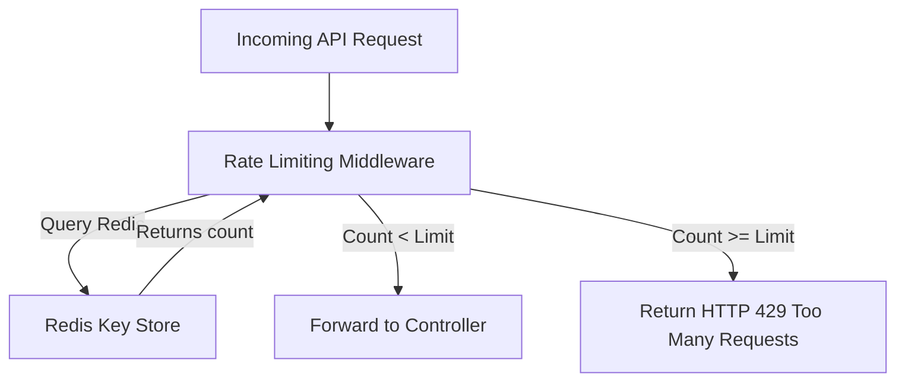

# Security & Content Protection Design Document

This document defines the security architecture, data protection measures, API security controls, anti-piracy strategies, and disaster recovery replication mechanisms for the Leitner Learning Platform. 

Due to technical restrictions, sanctions, and network filtering inside Iran, this architecture is designed to use **domestic cloud infrastructure** and **sanction-resilient services** to ensure reliability and speed.

---

## 1. Local Encryption & Storage Protection (Client-Side)

To prevent data scraping and content theft of premium courses on Android and iOS devices, all downloaded courses and client states are encrypted at rest.

### A. SQL Database Encryption (SQLCipher)
*   **Database Engine:** The local application database (`app_local.db` and downloaded `course.db` files) uses **SQLCipher** with **AES-256** block encryption.
*   **Decryption Key Generation:**
    1. During registration/login, the backend generates a cryptographically random, user-specific salt.
    2. The mobile client generates a device-unique identifier.
    3. The decryption key is derived using **PBKDF2-HMAC-SHA256** with 10,000 iterations:
       $$\text{Key} = \text{PBKDF2}(\text{DeviceUniqueID}, \text{UserSalt}, \text{Iterations}=10000)$$
    4. The derived key is fed to SQLCipher on database initialization.

```text
[User Salt (from API)] + [Device Unique ID]
                     │
                     ▼ (PBKDF2-HMAC-SHA256)
             [AES-256 Key]
                     │
                     ├────────► [Stored in System Keystore/Keychain]
                     ▼
             [SQLCipher Engine] ◄──► [Encrypted local SQLite files]
```

### B. Secure Storage & Hardware Keystore Integration
*   **Key Storage:** The derived decryption key is stored in the device's secure storage:
    *   **iOS:** Apple Keychain services (using the `kSecClassGenericPassword` attribute).
    *   **Android:** Android Keystore System (encrypted using AES-GCM and stored in shared preferences).
*   **Keystore Fallback Strategy:**
    *   *Problem:* Many low-end Android devices in Iran run custom ROMs or older Android versions where the hardware-backed KeyStore is corrupt, missing, or throws provider errors, causing crashes.
    *   *Solution:* If hardware-backed Keystore operations throw a `KeyStoreException`, the mobile client logs the warning and falls back to a **Software-based Encryption Layer**:
        1. Derive a fallback key using Android's Secure Settings Secure ID (`Settings.Secure.ANDROID_ID`) and an internal static salt.
        2. Encrypt the app keys using AES-256-GCM in software.
        3. Persist the encrypted keys in the app's sandboxed private `SharedPreferences`.

### C. Course Assets Protection (Images & Audio)
*   Course packages downloaded as ZIP archives contain media files (images, audio) pre-encrypted on the server using **AES-256-CBC** during packaging.
*   **Dynamic RAM Decryption:** To avoid writing decrypted files back to the device storage where a rooted user can copy them, files are read into RAM buffers, decrypted in-memory, and loaded into Flutter Image/Audio elements using memory streaming (`Image.memory`).
*   **Streaming Local Server:** For large audio files where reading the entire file into memory is inefficient, the app hosts a temporary, sandboxed HTTP server on a random localhost port (`http://127.0.0.1:port`). Flutter's audio player streams chunks from this local proxy, which decrypts the encrypted files on-the-fly.

---

## 2. API Security & Access Control (Server-Side)

### A. JWT Authentication Architecture
*   All requests to protected endpoints require a bearer JWT in the Authorization header.
*   **Token Lifecycle:**
    *   **Access Token:** Expired after **15 minutes**. Signed using **HS256** (or **RS256** using a private key loaded via environment variables). Includes user claims (`sub`, `username`, `role`).
    *   **Refresh Token:** Expired after **30 days**. Random cryptographically secure GUID stored in the PostgreSQL database with the user ID, device fingerprint, and expiration.
*   **Revocation Flow:** Admin block actions or user logout immediately revokes the refresh token from the database. A short access token expiry minimizes the vulnerability window.

### B. Role-Based Access Control (RBAC)
Endpoints are structured by namespace and restricted by policy claims:

| Route Namespace | Required Claim | Allowed Actions |
| :--- | :--- | :--- |
| `/api/v1/auth/*` | *Anonymous* | OTP Request, OTP Verify, Refresh Token |
| `/api/v1/courses/*` | `Role: Student` | Browse catalog, verify purchase, get download token |
| `/api/v1/statistics/*` | `Role: Student` | Sync study progress, view analytics |
| `/api/v1/admin/*` | `Role: Admin` | Course upload, user ban, edit purchases, audit logs |

### C. Rate Limiting Middleware
To prevent brute-force attacks and resource exhaustion, rate-limiting is implemented in ASP.NET Core using **Redis** for state tracking:



*   **OTP API Rate Limits:** 5 SMS requests per hour per mobile number/IP. If exceeded, returns `429 Too Many Requests` with a retry delay.
*   **General API Rate Limits:** 100 requests per minute per IP address.
*   **Admin API Rate Limits:** 60 requests per minute per authenticated user.

### D. Self-Hosted Captcha System
*   *Problem:* Google reCAPTCHA is blocked or severely slowed down due to network filtering inside Iran, making authentication loops fail.
*   *Solution:* The backend implements a self-hosted, server-generated math/visual CAPTCHA endpoint (`/api/v1/auth/captcha`):
    1. The endpoint returns a unique tracking ID and a Base64-encoded image of the CAPTCHA code (with background noise and warping).
    2. The server stores the SHA-256 hash of the answer combined with a secret server salt in Redis with a 2-minute expiration:
       $$\text{Hash} = \text{SHA256}(\text{Answer} + \text{Salt})$$
    3. The client submits the user input and the tracking ID during OTP verification. The backend validates the input before triggering SMS generation.

---

## 3. Domestic Infrastructure Integrations

### A. SMS OTP Verification (Iran Carrier Support)
Since international carriers are blocked or ban (+98) destinations, the backend utilizes a domestic SMS adapter contract:

```csharp
public interface ISmsService {
    Task<bool> SendOtpAsync(string mobileNumber, string code);
}
```

*   **Provider Implementations:**
    *   **Kavenegar:** Calls `/v1/{apikey}/verify/lookup.json` to send transactional OTP messages using pre-approved token patterns (fastest delivery, bypasses spam filters).
    *   **Faraz SMS:** Accesses their pattern-based REST API to send SMS via IPPanel.
    *   **SMS.ir:** Calls their REST API endpoint for OTP/verification messaging.
*   **Failover & Resiliency:** The app maintains primary and secondary SMS providers. If the primary provider API returns a non-200 response or high latency, the system automatically routes subsequent SMS verification requests to the secondary provider for up to 1 hour.

### B. Payment Gateways (Shetab Integration)
*   **In-App Purchase (IAP) Android:**
    - The client app integrates with the **Cafe Bazaar Billing Library** and **Myket Billing Library**.
    - When a user purchases a course, the transaction token is sent to the backend `/api/v1/purchase/verify/bazaar` or `/api/v1/purchase/verify/myket`.
    - The backend verifies the transaction token against Bazaar's/Myket's developer APIs using the stored client credentials.
*   **Direct Payment Gateway (ZarinPal):**
    - Useful for alternative distribution platforms or direct web links.
    - Uses the **ZarinPal Rest v4 API** (`https://api.zarinpal.com/pg/v4/payment/request.json`).
    - The backend handles requests, redirects the user to the Shaparak gateway, and validates the transaction on the callback route (`/api/v1/purchase/verify/zarinpal`).

---

## 4. Anti-Piracy & Watermarking Strategy

To prevent premium content leakage, sharing, and screenshots on Telegram and Rubika, multiple protection layers are established:

### A. Dynamic Overlay Watermarking
*   The flashcard review viewport includes an overlay layer rendering a semi-transparent, diagonal watermark.
*   **Watermark Content:** Obfuscated student identifier (e.g., `User: 0912***5678 (ID: a3b1)`) and current device date.
*   **Evasion Defenses:**
    1. **Random Offset shifting:** The watermark's diagonal angle (between $30^\circ$ and $45^\circ$) and coordinates shift slightly on every card transition, preventing script-based automatic watermark removal.
    2. **Low-Opacity Rendering:** The text opacity is set to $0.08$ so it does not distract the student, but is fully legible when screenshots are brightened/contrasted.

```text
┌──────────────────────────────────────┐
│  Flashcard Header                    │
├──────────────────────────────────────┤
│                                      │
│      Question: What is ... ?         │
│                                      │
│    0912***5678      0912***5678      │
│         0912***5678      0912***5678 │
│                                      │
├──────────────────────────────────────┤
│  [Don't Know]               [Know]   │
└──────────────────────────────────────┘
```

### B. Download Protection & Tokenized Links
*   Course SQLite files are stored in S3 bucket private storage.
*   When a user clicks "Download", the server verifies active purchase status in PostgreSQL.
*   If valid, the server issues a single-use token and signed pre-signed S3 URL:
    - **Signed URL Expiration:** 10 minutes.
    - **Endpoint:** Points to local CDN endpoints (e.g., ArvanCloud edge nodes in Tehran) to ensure fast, low-cost download speeds inside the national intranet (NIX).

---

## 5. Disaster Recovery & Off-Server Backups

To guarantee data safety and business continuity, all registration, purchase, and configuration data are replicated off-server immediately.

### A. Real-Time Event-Driven Replication
*   Upon any critical state modification (e.g., `UserRegistered`, `PurchaseCompleted`, `PurchaseModified`), the backend issues an event via the Redis event bus.
*   An async background task (Hangfire) captures this event and replicates the specific data payload to:
    1. A secondary read-replica database hosted in an independent domestic datacenter (e.g., Shatel or Afranet).
    2. An encrypted file storage system on **ArvanCloud/ParsPack Object Storage** using AWS S3 APIs.

### B. Automated Server Database Backups
*   A containerized backup service runs inside the Docker Compose network.
*   **Cron Schedule:** Every night at 02:00 AM (local time).
*   **Backup Script Actions:**
    1. Execute `pg_dump` to generate a compressed SQL dump.
    2. Encrypt the backup archive using **GnuPG** (AES-256) with a key stored in the environment configuration.
    3. Upload the encrypted file via S3 API to the domestic object storage bucket.
    4. Upload a copy to a remote SFTP backup server using SSH authentication.
*   **Retention Policy:**
    *   *Daily Backups:* Retained for **30 days**.
    *   *Weekly Backups:* Retained for **12 weeks**.
    *   *Monthly Backups:* Retained for **1 year**.

---

## 6. Secrets Management Policy

To ensure security keys and credentials are never exposed:
1. **Zero Secrets in Code:** Hardcoded API keys, DB passwords, JWT signing keys, or SFTP passwords within the application code are strictly forbidden.
2. **Environment Variable Injection:** All secrets are supplied through environment variables inside `.env` configurations (in development) or Docker secrets (in production).
3. **Template Environment Configuration:** A `.env.example` file is committed to Git as a blueprint, containing dummy values and documentation for each variable.
4. **Git Protection:** The `.gitignore` file includes strict rules prohibiting `.env`, `.pem`, and certificate file commits.
