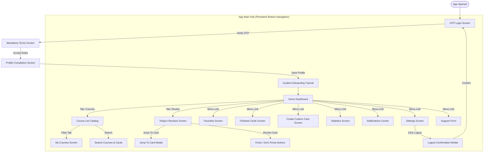

# UI/UX Design Specification

This document details the visual design system, color palettes, component specifications, and user flow mappings for the Leitner Learning Platform.

---

## 1. Visual Design System

### 1.1 Typography
*   **Primary Typeface:** `Outfit` (sans-serif) - Used for headings, action buttons, card titles, and progress metrics.
*   **Secondary Typeface:** `Inter` (sans-serif) - Used for body copy, descriptions, form inputs, and notification messages.
*   **Fallback Font Family:** `sans-serif`

### 1.2 Color System (High-Fidelity)
The interface uses a premium, dark-mode-first aesthetic utilizing HSL colors to ensure harmony and contrast:

| Color Token | Description | HSL Hex Value |
| :--- | :--- | :--- |
| **Primary / Accent** | Brand main action color (Neon Purple/Indigo) | `hsl(263, 90%, 65%)` / `#8F53FF` |
| **Secondary** | Secondary actions / Highlights (Teal) | `hsl(174, 90%, 45%)` / `#09E5C3` |
| **Background** | Deep background, clean dark layout | `hsl(222, 25%, 10%)` / `#121620` |
| **Surface** | Container background cards (Semi-transparent) | `hsla(223, 20%, 15%, 0.7)` |
| **Border** | Base subtle border separator | `hsla(223, 15%, 25%, 0.4)` |
| **Text Primary** | High-contrast readable title text | `hsl(210, 40%, 98%)` / `#F3F6FA` |
| **Text Secondary** | Medium-contrast description body text | `hsl(215, 20%, 75%)` / `#B8C1CD` |

### 1.3 Leitner Box State Colors
Progress indicators and state indicators on flashcards are strictly color-coded:

*   🟧 **Box 1 (Orange):** `hsl(25, 95%, 55%)` / `#FF7A1A`
*   🟨 **Box 2 (Yellow):** `hsl(45, 95%, 55%)` / `#FFB61A`
*   🟩 **Box 3 (Green):** `hsl(145, 80%, 45%)` / `#17C964`
*   🟦 **Box 4 (Blue):** `hsl(200, 90%, 55%)` / `#1A9CFF`
*   🟪 **Box 5 (Purple):** `hsl(280, 85%, 60%)` / `#C333FF`
*   🟨 **Finished (Gold):** `hsl(48, 100%, 50%)` / `#FFD700`

### 1.4 Course Border Indicators
Courses displayed in catalogs and the dashboard must follow these strict visual guidelines:

*   🟢 **Downloaded / Purchased:** `hsl(145, 80%, 45%)` / `#17C964` border. Placed at the top of the course catalog list.
*   🟡 **Not Purchased / Not Downloaded:** `hsl(45, 95%, 55%)` / `#FFB61A` border.

---

## 2. Component Library

### 2.1 Global Bottom Navigation
*   **Placement:** Persistent at the very bottom of the viewport on all main dashboard screens.
*   **Height:** `64px`.
*   **Blur Effects:** Glassmorphism (`backdrop-filter: blur(16px); background: hsla(222, 25%, 10%, 0.8)`).
*   **Tabs:**
    1.  **Home:** Navigates to the Dashboard.
    2.  **Review (Today's Cards):** Direct link to due cards queue. Displays red badge count of due reviews.
    3.  **Courses:** Lists courses (Catalog / My Courses tabs).

### 2.2 Flashcard Component
*   **Dimensions:** Aspect ratio `3:4` (e.g. `320px` width, `420px` height) centered on screen.
*   **Flip Mechanics:** Uses CSS 3D Transforms (`transform-style: preserve-3d; transition: transform 0.6s cubic-bezier(0.4, 0, 0.2, 1)`). Clicking the card toggles a active `.flipped` class, rotating the card 180 degrees around the Y-axis.
*   **Conditional Media Rendering:**
    - If `image_url` is null: The image block is collapsed completely, adjusting card text vertical spacing.
    - If `audio_url` is null: The audio player controller button is hidden.
*   **Jump-To-Card Dialog:** Clickable card index indicator (e.g. "Card 5/30"). Tapping triggers a modal dialog allowing users to enter a card number.
    - *Warning Trigger:* If card number entered is in active boxes (Boxes 2–5), displays a warning: *"Jumping directly to this card will reset its Leitner stage back to Box 1. Proceed?"* If confirmed, performs reset and jumps.

### 2.3 Settings Logout Modal
*   **Warning Trigger:** Selecting "Logout" in Settings displays a modal confirmation screen with text: *"Are you sure you want to log out? Un-synchronized local course settings and user-created cards may be affected."*
*   **Actions:** "Confirm Logout" (red accent button) and "Cancel" (gray background).

---

## 3. User Flow Mapping

The application follows a structured, linear flow for initial setup, followed by a modular hub-and-spoke configuration based on the bottom navigation menu.

---

## 4. Guided Onboarding Tutorial Step Sequence

First-time users are guided through an interactive layout highlighting key platform items sequentially:

1.  **Courses:** Catalog listing and visual border status indicators.
2.  **Search:** Searching courses and deep card indexing.
3.  **Flashcard:** Layout structure (Header, Card Front).
4.  **Know Button:** Swiping or clicking "Know" to move cards forward.
5.  **Don't Know Button:** Swiping or clicking "Don't Know" which resets cards back to Box 1.
6.  **Create Card:** Form for adding custom user flashcards.
7.  **Finished Cards:** Reviewing learned content list and badge indicator.
8.  **Favorites:** Custom bookmarking system.
9.  **My Courses:** Accessing purchased/downloaded modules offline.
10. **Reports:** Reporting content typos or issues.
11. **Today's Cards:** Daily spaced-repetition due count.
12. **Statistics:** Viewing progress graphs mapped by color tokens.
