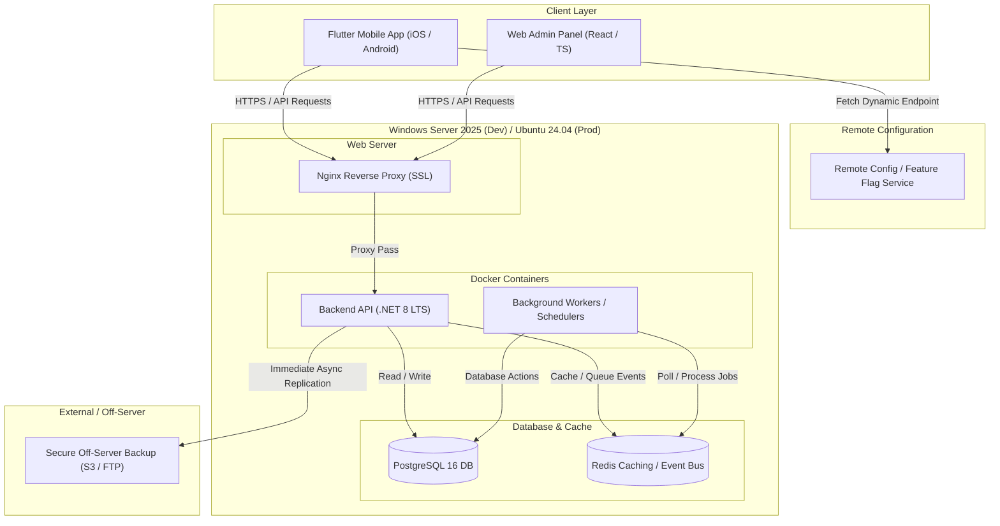
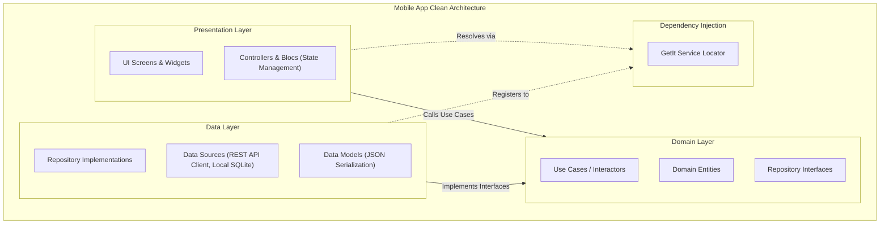
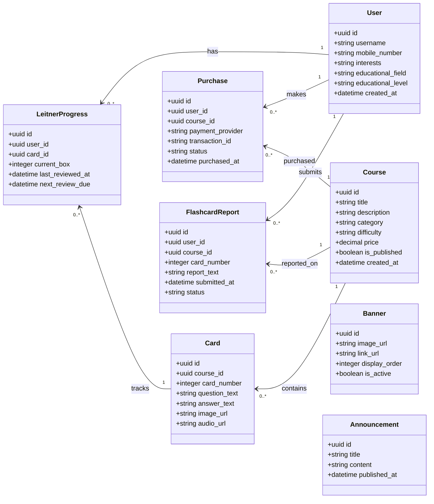
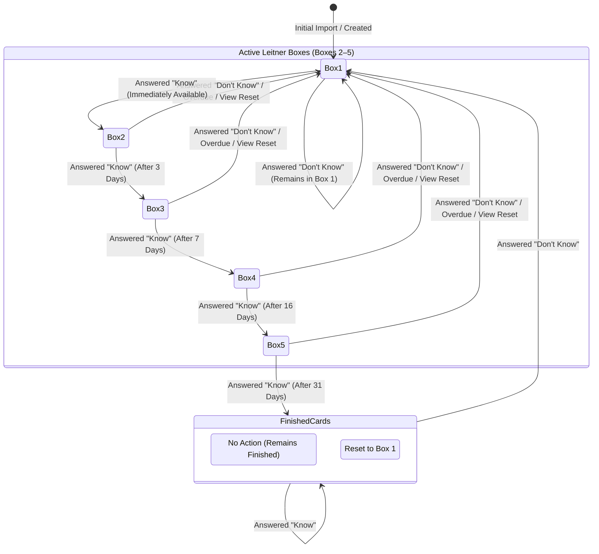
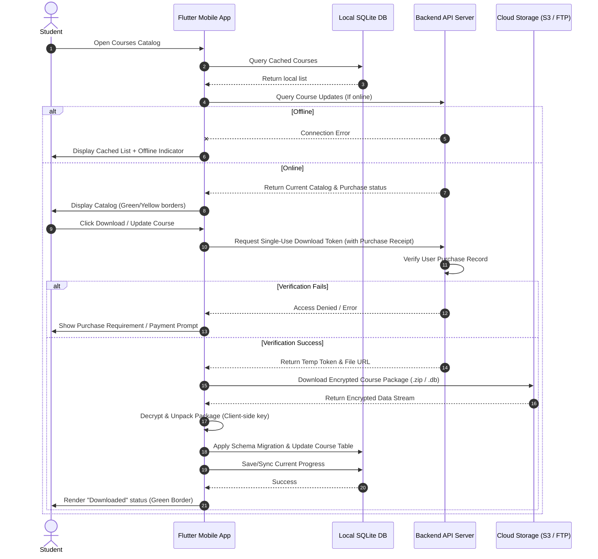

# Leitner Learning Platform – Complete Implementation Plan (Revised)

**Project Duration:** 60 Days
**Platforms:** Android + iOS + Backend API + Admin Panel
**Project Type:** Offline-First Leitner Learning Platform
**Delivery Model:** Phase-based with approval and testing after each phase

## Project Progress Dashboard

| Phase | Description | Status | Deliverable |
| :--- | :--- | :--- | :--- |
| **Phase 0** | Project Scope Definition & Contract Lock | 🟢 **Completed** | [rcd.md](file:///e:/projects/leitner-learning-platform/rcd.md) |
| **Phase 1** | System Architecture & Technical Design | 🟢 **Completed** | Architecture Package |
| **Phase 2** | Security & Content Protection Design | 🟢 **Completed** | [security_design.md](file:///e:/projects/leitner-learning-platform/docs/security/security_design.md) |
| **Phase 3** | Course Database Specification | 🟢 **Completed** | Course Authoring Kit & Sample Course |
| **Phase 4** | UI/UX Design | 🟢 **Completed** | [ui_design.md](file:///e:/projects/leitner-learning-platform/docs/ui/ui_design.md) & [Prototype](file:///e:/projects/leitner-learning-platform/docs/ui/prototype/index.html) |
| **Phase 5** | Backend Foundation | 🟢 **Completed** | Backend APIs v1 (OTP, Login, Profile) |
| **Phase 6** | Admin Panel Foundation | 🟢 **Completed** | Pluggable Admin Portal v1 |
| **Phase 7** | Course Management System | 🟢 **Completed** | Course Management Module |
| **Phase 8** | Mobile Foundation | 🟢 **Completed** | Mobile Client v1 (Auth, Rules, Profile) |
| **Phase 9** | Offline Download & Storage System | 🟢 **Completed** | Encrypted SQLite storage & Sync Engine |
| **Phase 10** | Leitner Engine & Special Rules | 🟢 **Completed** | Spaced Repetition Timings & Reset Logic |
| **Phase 11** | Flashcard Learning Module | 🟢 **Completed** | Study interface, Onboarding, Reports |
| **Phase 12** | Advanced Learning Features | 🟢 **Completed** | Today's Cards, IAP, Backups & Restore |
| **Phase 13** | Search, Analytics & Statistics | 🟢 **Completed** | Typo-Tolerant Search & Progress Metrics |
| **Phase 14** | Notifications & Banner System | 🟢 **Completed** | Notification center & Dashboard Carousel |
| **Phase 15** | Server Migration & Dynamic Config | 🟢 **Completed** | Remote Config Service & Dynamic Failover |
| **Phase 16** | Security Hardening | 🟢 **Completed** | API Rate Limiting, Obfuscation & Logs |
| **Phase 17** | QA & User Acceptance Testing | 🟢 **Completed** | Integration/UAT Sign-off & Docker Package |
| **Phase 18** | Store Builds & Publishing | 🟢 **Completed** | Premium (IAP) & Store Builds published |
| **Phase 19** | Source Code Handover & Training | 🟢 **Completed** | Full source code transfer & Setup guides |
| **Phase 20** | Post-Publishing Mobile App Feature & Gap Analysis | 🟢 **Completed** | [mobile_app_feature_analysis.md](file:///C:/Users/Administrator/.gemini/antigravity-ide/brain/45a4786e-08df-4c7d-a741-21daf77a4770/mobile_app_feature_analysis.md) |
| **Post-Dev** | Support & Warranty | ⚪ Pending | 1-Month Warranty & Lifetime Support |

**Current Completion:** **100%** (21 / 21 Phases Completed)


---

## Key Performance & Compatibility Targets (Proposed Technical Assumptions)
* **Optimized Execution:** Optimized codebase to ensure smooth transitions (minimum 60 FPS) and quick page load times.
* **Minimal Memory Footprint:** Strict RAM usage limits (targeting less than 150MB active RAM on standard mobile devices) through efficient asset lifecycle management and garbage collection.
* **Small App Size:** Application package (APK/IPA) size optimized using asset compression and dynamic module delivery to ensure ease of download.
* **External Storage Support:** Android build compiled to support installation on external storage (SD cards).

---

# Phase 0 – Project Scope Definition & Contract Lock (Completed)

## Objectives

Prevent misunderstandings and scope creep before development begins.

## Tasks

### Requirement Review

Review:

* PDF requirements
* Conversation agreements
* Publishing requirements
* Security requirements
* Offline requirements

### Define Included Features

Document all agreed features.

### Define Excluded Features

Examples:

* Web application
* Multi-language support
* AI-generated flashcards
* Social network features
* Live chat

### Support Definition

Define:

* Bug warranty period
* Free revision count
* Future update pricing policy
* Support policy

---

## Deliverables

### Requirements Clarification Document (RCD)

Contains:

* Included features
* Excluded features
* Acceptance criteria
* Revision policy
* Publishing responsibilities (Developer is responsible for successful submission, review handling, and publication in Google Play, Cafe Bazaar, and Myket)
* Source code ownership
* **Scope Hierarchy Rule:** Any functionality explicitly stated in the PDF, in written conversation, or reasonably required for a complete and production-ready implementation of those requirements shall be considered included in the project scope unless specifically excluded in writing. The PDF defines the framework; anything required by standard application practices should still be implemented.

---

## Acceptance Test

Client reviews and approves document.

### Output

[x] ✔ Scope Locked (Requirements Clarification Document created at [rcd.md](file:///e:/projects/leitner-learning-platform/rcd.md))

---

# Phase 1 – System Architecture & Technical Design

## Objectives

Design the entire platform before coding, enforcing enterprise-grade extensibility, modularity, and clean boundaries.

## Tasks

### Application Architecture

Design:

* Mobile Architecture
* Backend Architecture
* Admin Panel Architecture

### Core Architectural Extensibility & Design Patterns

Formally define and design the following patterns:

* **Feature-Based Clean Architecture (Mobile):** Structure the codebase by independent feature domains (e.g., `auth/`, `courses/`, `flashcards/`, `statistics/`, `notifications/`, `favorites/`, `settings/`) rather than flat layer folders (`screens/`, `services/`, `widgets/`). Isolate domain logic, UI presentation, and data sources within each feature module.
* **Repository Pattern (Mobile):** UI components and Use Cases access data through a Repository layer (UI -> Use Cases -> Repository -> Data Source). This prevents UI components from depending directly on SQLite databases or raw API client classes.
* **Backend Domain Separation:** Split backend services into decoupled domain modules (Auth, User, Course, Purchase, Notification, Analytics, Configuration) with strict database access rules to ensure changes to one module do not destabilize others.
* **Plugin-Friendly Admin Panel:** Structure the Admin Panel with a pluggable layout interface. The core screens (Users, Courses, Purchases, Reports, Notifications, Banners, Settings) should be independent modules, making it easy to register future modules (Coupons, Subscriptions, Affiliate Systems, AI Tools) without refactoring the core console.
* **Event-Driven Internal Design:** Implement an event emitter/event bus system on both backend and frontend. Emit core domain events (e.g., `Purchase Completed`, `Course Downloaded`, `Card Reviewed`, `Card Finished`, `Report Submitted`) to decouple secondary services (e.g., analytics, email/SMS alerts, achievements, badges, leaderboards) from core business logic.
* **Dependency Injection & Service Abstraction:** Decouple infrastructure services by defining abstract interfaces (e.g., `NotificationService`, `StorageService`, `EncryptionService`, `AnalyticsService`, `PaymentProvider`). Use Dependency Injection (DI) to inject concrete implementations, making it simple to swap providers (e.g., Firebase to OneSignal, AWS to Cloudflare, or local DB engines) later.
* **Versioned REST APIs:** Route all backend APIs using versioned pathways (e.g., `/api/v1/`, `/api/v2/`) to ensure backward compatibility and smooth deprecation flows for older client builds in production.
* **Unified Payment Gateway Abstraction:** Design a generic `PaymentProvider` interface to handle receipt verification, purchases, and catalog synchronization, allowing seamless swapping of payment adapters (e.g., Google Play In-App Purchase, Cafe Bazaar, Myket, Direct Payment Gateway).
* **Feature Flag System:** Define a generic feature flagging service interface to enable or disable features (such as AI capabilities, beta layouts, or experimental search) remotely without updating the app package.
* **Cross-Platform Server Compatibility:** The backend, admin panel, deployment scripts, database migrations, backup systems, and all supporting services shall be developed and tested to run identically on both Windows Server 2025 and Linux (Ubuntu/Debian/RHEL-compatible distributions). The production deployment target shall be Linux-first (even if development occurs on Windows). No features may depend on Windows-only APIs, IIS-only features, Windows Registry, or Windows-specific libraries.
* **OS-Independent Filesystem Operations:** All filesystem operations shall use platform-independent path APIs (e.g., `Path.Combine` or equivalent framework abstractions) rather than assuming Windows path separators.
* **OS-Independent Background Schedulers:** Background and scheduled jobs must be implemented using application-level schedulers (e.g., Hangfire, Quartz, Celery, BullMQ, or containerized cron) rather than OS-specific schedulers (such as Windows Task Scheduler or OS-level crontab).
* **Docker Containerization:** The Backend API, Admin Panel, Database, and Background Workers shall be deployable using Docker. A `Docker Compose` deployment package must be designed in Phase 1 and completed by handover.

### Database Architecture & Migration Strategy

Define:

* User Database
* Purchase Database
* Progress Database
* Notification Database
* Banner Database
* Reports Database (stores user ID, user mobile number, course ID/title, card number, report text, timestamp, and review status)
* **Database Migration Framework:** Define versioned migration strategies for both server databases and local client SQLite databases. All schema updates must support versioned migrations with raw scripts stored in source control.

### Development Environment & Technology Stack

The development team shall document, lock, and obtain written client approval for all major technology selections before implementation begins. The specified technology stack and environment parameters must satisfy:

* **Technology Locking Clause:** All major technology selections shall be finalized and documented during Phase 1. Any changes to the agreed technology stack after Phase 1 require written client approval.
* **LTS Version Enforce:** All core framework and dependency runtime versions must be LTS (Long-Term Support) releases unless otherwise approved by the client in writing.
* **Development Machine Prerequisites (Windows Server 2025):**
  * **Required Software:**
    - .NET 8 LTS SDK / Runtime (ASP.NET Core Web API, EF Core)
    - Flutter SDK (3.x LTS) & Dart SDK
    - Android Studio & Android SDK (Java JDK 21)
    - Node.js (v22 LTS) & npm/yarn
    - PostgreSQL 16 (local development database)
    - Redis (optional local caching)
    - Docker Desktop / Engine & Docker Compose
    - Visual Studio 2022 / VS Code (configured for Flutter and .NET)
    - Git
    - Nginx (optional local reverse proxy testing)
  * **Minimum Hardware Requirements:**
    - CPU: 8 Cores (minimum)
    - RAM: 32 GB (minimum)
    - Storage: 500 GB+ SSD (minimum)
* **Linux Production Server Stack:**
  * **Operating System:** Ubuntu 24.04 LTS (or compatible production-grade Linux distribution)
  * **Engine & Containers:** Docker Engine & Docker Compose (orchestrating API server, database, worker, caching)
  * **Reverse Proxy:** Nginx (configured with SSL via Let's Encrypt / custom certs)
  * **Databases:** PostgreSQL 16
  * **Caching:** Redis (session, rate-limiting, event caching)
* **Core Technology Stack Selection Criteria (to be finalized and approved in Phase 1):**
  * Mobile framework & SDK versions
  * Backend framework & runtime versions
  * Database engine, ORM framework, and Migration framework versions
  * Admin panel framework & UI libraries (React / TS)
  * Caching & background scheduler engines
  * Containerization & CI/CD platform config
  * Testing frameworks (xUnit/NUnit, Flutter Test, Playwright/Cypress)

### Source Control, CI/CD & Testing Standards

Define project delivery standards to ensure codebase integrity and automated quality checks:

* **Source Control Policies:**
  - Mandatory use of Git with complete commit history.
  - Core branch architecture with main branch protection rules (direct commits to main disabled; merges only via reviewed Pull Requests).
  - Defined development branch workflow (feature branching structure).
* **Automated CI/CD Pipelines:**
  - Automated build pipelines configured for backend APIs, admin panels, and mobile apps (iOS & Android).
  - Automated test execution on every pull request / merge request.
  - Automated Docker image builds for backend APIs, background workers, and admin panels.
* **Testing & Quality Standards:**
  - Unit and Integration tests for backend logic (targeting min 80% business logic code coverage).
  - Unit and widget tests for mobile feature domains (targeting min 70% coverage on core Leitner engine and sync logic).
  - End-to-End (E2E) testing framework setup for critical user journeys (authentication flow, course download, review loop) using Playwright or Appium.

### API Architecture

Design versioned endpoints:

* Versioned Authentication APIs (`/api/v1/...`)
* Versioned Course APIs (`/api/v1/...`)
* Versioned Purchase APIs (`/api/v1/...`)
* Versioned Admin APIs (`/api/v1/...`)
* Versioned Statistics APIs (`/api/v1/...`)
* Versioned Remote Configuration & Feature Flag APIs (`/api/v1/config/...`)

### Offline Architecture

Define:

* Download process
* Local storage
* Synchronization process

## UML Architecture Diagrams

The following UML diagrams formally specify the system structure, package dependencies, and relational database schema:

### 1. High-Level System Architecture Diagram (UML Deployment & Component Layout)


### 2. Mobile Clean Architecture & Module Dependency Diagram (UML Package Layout)


### 3. Database Entity Relationship (ER) Diagram (UML Class Diagram Layout)


### 4. Leitner Card Progression & Reset Lifecycle (UML State Machine Diagram)


### 5. Offline Course Synchronization & Download Workflow (UML Sequence Diagram)


---

## Deliverables

### Architecture Package

* System Architecture Diagram
* Database ER Diagram
* API Documentation (with explicit `/api/v1/` routes)
* Synchronization Flow
* Architectural Design Document (specifying Feature-Based structure, repository flows, domain isolation rules, event bus contracts, DI interfaces, feature flag schema, pluggable admin schema, payment abstraction interfaces, OS-independent filesystem rules, scheduler strategy, and Docker architecture)
* Technology Stack Specification (detailing mobile/backend framework versions, ORM, database, cache, container, and testing tools selected)
* Windows Server 2025 Development Environment Setup Checklist
* Linux Production Server Deployment Specification
* CI/CD Pipeline Configuration Files & Documentation (e.g. GitHub Actions workflows, automated build scripts)
* Versioned Database Migration Schemas (Server & Client SQLite)
* Initial Dockerfile templates and Docker Compose layout

---

## Acceptance Test

Review architecture with client.

### Output

[x] ✔ Architecture Approved (Architecture Package created in [docs/architecture](file:///e:/projects/leitner-learning-platform/docs/architecture/) and [deployment](file:///e:/projects/leitner-learning-platform/deployment/))

---

# Phase 2 – Security & Content Protection Design

## Objectives

Design security before implementation.

## Tasks

### Content Protection

Define:

* Course encryption
* Local encryption
* Secure storage

### API Security

Define:

* JWT authentication
* Access control
* Rate limiting

### Anti-Piracy

Define:

* Watermark strategy
* Download protection
* Tokenized downloads

### Backup Strategy

Define:

* Automatic off-server backups: immediate backup replication of user registration and purchase data upon every change, stored securely outside the main server (e.g. S3, FTP, or remote secure storage)
* Email Logging: Immediately log user registration and purchase transactions via email (e.g., to a designated administrative email account).
* Backup retention policy

### Secrets Management

* **No Secrets in Source Code:** Ensure no hardcoded secrets, API keys, passwords, or encryption keys exist within the application source code.
* **No Git Credentials:** Strictly prohibit committing any configuration files or files containing credentials/secrets to Git.
* **Environment-Driven Configuration:** Supply all production secrets exclusively via environment variables or secret management systems.

---

## Deliverables

### Security Design Document

Contains:

* Encryption strategy
* Offline protection strategy
* Watermarking strategy
* Server hardening plan
* Secrets management policy and template environment configuration

---

## Acceptance Test

Client approves:

* Security model
* Encryption model
* Offline protection model

### Output

[x] ✔ Security Approved (Security Design Document created at [docs/security/security_design.md](file:///e:/projects/leitner-learning-platform/docs/security/security_design.md))

---

# Phase 3 – Course Database Specification

## Objectives

Provide database standards for content creation, including schema versioning and local SQLite migration strategies.

## Tasks

### SQLite Schema Design & Versioning

Define:

* Courses
* Cards
* Media
* Metadata
* **Schema Migration Strategy:** Specify how local course SQLite schemas will handle updates and database migrations when a newer course version is downloaded, ensuring progress is preserved.

### Course Packaging Format

Define folder structure.

### Sample Course Creation

Create working example.

---

## Deliverables

### Course Authoring Kit

```text
course_package/
├── course.db
├── images/
├── audio/
└── manifest.json
```

### Documentation

* SQLite schema
* Media standards
* Import rules

### Sample Course

One complete sample course.

---

## Acceptance Test

Client successfully creates a test course.

### Output

[x] ✔ Content Production Started (Course Authoring Kit and Sample Course created)

---

# Phase 4 – UI/UX Design

## Objectives

Create all application screens.

## Tasks

### Wireframes

Design:

* Login
* Profile (including username, interests, educational field, educational level selected from predefined lists. Note: Mobile number field is read-only/non-editable by the user.)
* Home
* Global Bottom Navigation (Visible on all main screens, containing persistent navigation tabs: Home, Review, Courses)
* Course List (Visual rule: Downloaded/purchased courses must appear at the top. Downloaded courses get a green border; not purchased/not downloaded courses get a yellow border. Display course title, card count, paid/free status, and colored border. Include course search result long-click selection capability, and search text placeholder `"جستجو در عنوان دوره ها"`. When offline: display previously downloaded course list with a clear status message indicating that internet is unavailable and update was not performed.)
* My Courses Screen (Displays only purchased and downloaded courses, visual green border for downloaded status)
* Flashcards Screen (Visual layout: Fixed header displaying course title, colored Leitner stage indicator, card number at top right below title, and favorite star toggle. Rotating center card supporting text, images, audio, and multiple-choice options with flip-on-touch animation, and conditional rendering to hide empty sections. Fixed footer containing Know button on the right, Don't Know button on the left, and Report issue button below them. Navigation arrows flanking the card on the left and right sides of the screen rather than in the footer.)
* Favorites
* Today's Reviews (Displays a pending review count badge)
* Finished Cards (Displays a badge count)
* Statistics
* Notifications
* Create Card (Supports inputting: Course Title, Question, Options, and Answer for card creation)
* Settings (includes Font customization settings for flashcard texts, App theme selector, and a Logout button with a mandatory confirmation dialog prompting the user before execution)
* Support
* About Us (displays team descriptions/text provided by client, accessible from the menu drawer)
* Rules (displays persistent application terms/rules, accessible from the menu drawer)
* Mandatory Terms & Rules Acceptance Screen (Mandatory terms & rules acceptance after OTP verification and before profile completion)
* Onboarding & Guided Tutorials (First-run app walkthrough mapping out the specific PDF onboarding flow: Courses -> Search -> Flashcard -> Know button -> Don't Know button -> Create Card -> Finished Cards -> Favorites -> My Courses -> Reports -> Today's Cards -> Statistics; Leitner system guide; Color status guide). Help menu screen containing three separate trigger buttons for the App Walkthrough, the Leitner method explanation, and the Color status guide.

### UI Design

Create:

* Color system: The application defaults to Light Mode at launch, employing a cool-toned soft lavender-gray background color (`Color(0xFFF3F4F9)`) for the application background, pure white (`Color(0xFFFFFFFF)`) card surfaces with soft drop shadows, and dark purple-indigo text tones. Dark Mode is aligned to a rich deep indigo/purple backdrop (`Color(0xFF181837)` background and `Color(0xFF22224E)` surface) matching the study overlay screen color scheme.
* Leitner box colors
* Component library

### Interactive Prototype

User flow simulation.

---

## Deliverables

* Figma Design File
* Wireframes
* UI Components
* User Flow Map

---

## Acceptance Test

Client approves designs.

### Output

[x] ✔ UI Approved (UI Specification created at [ui_design.md](file:///e:/projects/leitner-learning-platform/docs/ui/ui_design.md) and Interactive Prototype created at [docs/ui/prototype](file:///e:/projects/leitner-learning-platform/docs/ui/prototype/index.html))

---

# Phase 5 – Backend Foundation

## Objectives

Build server infrastructure with domain-separated architecture and database migration support.

## Tasks

### Server Setup & Modular Domain Layout
* Configure codebase to separate domains (Auth, User, Course, Purchase, Notification, Analytics, Configuration).

### Database Migration Setup
* Setup backend database migration framework (e.g., Flyway, Liquibase, or native ORM migrations). Include all initial schema tables under version control.

### Versioned Authentication APIs
* Implement versioned endpoint pathways under `/api/v1/auth`.
* OTP Login (using domestic SMS gateways like Kavenegar/Faraz SMS/SMS.ir with self-hosted math CAPTCHA)
* JWT Tokens

### User Management & Profile
* Profile Fields (username, interests, educational field, educational level. Note: Mobile number must be read-only/non-editable by the user.)

### Security Foundation (including JWT tokens, rate limiting, and self-hosted visual/math CAPTCHA challenge endpoint)

### Event Bus Setup
* Establish the backend event emitter system to publish domain events.

### CI/CD Build Pipeline Configuration
* Setup automated build and test pipeline (e.g. GitHub Actions) to compile code and run unit tests on every pull request/commit.

### Backup Foundation (Off-Server Replication & Email Logging)
* Automated, immediate replication of user registration and purchase data upon every change to a secure external domestic S3-compatible Object Storage (e.g., ArvanCloud/ParsPack or independent remote storage).
* Immediate SMTP/Email registration log containing user info and purchased courses sent to the administrative email account.

---

## Deliverables

### Backend v1

Working APIs (versioned under `/api/v1/`):

* Login
* OTP
* Profile

---

## Testing

### API Tests

### Authentication Tests

### Security Tests

---

## Acceptance

✔ Backend Foundation Approved

---

# Phase 6 – Admin Panel Foundation

## Objectives

Create administrative dashboard based on a pluggable architecture and core user management interfaces with action auditing.

## Tasks

### Pluggable Admin Dashboard Architecture
* Implement the core extension interface allowing independent administrative screens to be loaded dynamically as plugins.

### Admin Authentication

### User Management & Purchase Operations (Plugin Module)
* Search, view, and manage user accounts.
* Edit user purchase records.
* Activate or deactivate purchased courses for specific users.

### Dashboard & Reporting (Plugin Module)
* General analytics dashboard.
* System activity logs.
* Admin review interface to browse and filter submitted flashcard reports by card, course, or user, and flag content issues.

### Announcement & Banner Management (Plugin Module)
* Create and manage system-wide announcements.
* Upload, update, and manage promotional/educational banners.

### Audit Logging System (Plugin Module)
* Implement a system activity audit trail. Every administrative action must be logged: Who performed it, What was done, When it occurred, the Before Value, and the After Value (crucial for changes to purchases and course settings).

---

## Deliverables

### Admin v1

Working admin portal with pluggable module structure.

---

## Testing

* Login
* Permissions
* User editing

---

## Acceptance

✔ Admin Foundation Approved

---

# Phase 7 – Course Management System

## Objectives

Create course upload, metadata editing, and purchase activation tools.

## Tasks

### Upload & Package Courses
* Admin interface to upload SQLite course packages and media directories.

### Edit Course Metadata
* Edit course title, description, category, difficulty, pricing, and associated metadata.

### Publish & Deactivate Courses
* Toggle visibility and availability of courses for general users.

### Purchase Management
* Admin interface to manually activate or deactivate purchased courses for specific users.

### Download Permission Controls

---

## Deliverables

### Course Management Module

Admin can:

* Upload SQLite packages
* Publish courses
* Manage pricing

---

## Testing

### Upload Tests

### Download Tests

### Permission Tests

---

## Acceptance

✔ Course Management Approved

---

# Phase 8 – Mobile Foundation

## Objectives

Build application shell enforcing feature-based clean architecture, dependency injection, and repository patterns.

## Tasks

### Flutter Project Setup & Feature Folder Isolation
* Setup folder structures grouped by features (e.g., `auth/`, `courses/`, `flashcards/`, `statistics/`, `notifications/`, `favorites/`, `settings/`).
* Configure clean boundaries separating Data (Data Sources & Models), Domain (Use Cases, Entities, Repository Interfaces), and Presentation (UI Screens, Controllers/Blocs, Widgets) directories within each feature.

### Repository Pattern Implementation
* Implement the repository layer pattern. Ensure Use Cases communicate solely with Repository interfaces, separating the UI from direct dependency on SQLite helper objects or REST API network clients.

### Dependency Injection Setup
* Set up a DI container (e.g., GetIt) to register abstract service/repository interfaces and inject their concrete/mock implementations.

### Navigation
* Global Bottom Navigation bar visible on all primary application screens, containing persistent navigation to:
  1. Home (takes user back to the Main Home Dashboard screen)
  2. Review (takes user directly to the Today's Cards list screen)
  3. Courses (takes user to the Courses catalog screen)
* **Home Dashboard Layout & Clean Grid**:
  - **Main Feature Grid**: Displays a cleaned-up grid consisting solely of 6 core study modules: Today's Cards (کارت‌های امروز), Favorite Cards (کارت‌های منتخب), Finished Cards (کارت‌های پایان یافته), My Courses (دوره‌های من), Courses List (لیست دوره‌ها), and Create Card (ایجاد کارت جدید).
  - **Glossy 3D Asset Icons**: Mapped each of the 6 core modules to custom generated, glossy 3D graphic icon assets instead of flat system vectors.
  - **Sidebar Drawer Navigation (Application Menu)**: Integrated a custom side drawer accessible via a purple rounded menu button in the leading section of the app header. Secondary modules (Statistics, Notifications, Support, Settings, Help Guides, and Logout confirmation) are placed inside this Drawer to keep the primary dashboard space decluttered.

### Client Event Bus
* Setup a central client-side event bus.

### Mobile CI/CD Pipeline Setup
* Configure automated build pipelines and widget/unit tests for Android and iOS packages on every branch commit.

### State Management

### API Integration (using versioned `/api/v1/` routes)

### Authentication Screens
* **Mandatory Rules Screen:** Mandatory Terms & Rules acceptance step after OTP verification and before profile completion.

---

## Deliverables

### Mobile v1

Users can:

* Login & OTP verification
* Accept Terms & Rules
* Setup profile (username, interests, educational field, educational level selected from predefined lists; mobile number is locked/read-only)
* Enter app

---

## Testing

Android & iOS testing.

---

## Acceptance

✔ Mobile Foundation Approved

---

# Phase 9 – Offline Download & Storage System

## Objectives

Implement offline-first architecture.

## Tasks

### Course Download Manager

### Local SQLite Storage

### Local Encryption

### Synchronization System

### Course Updates

### Offline Course Catalog Display & Messages
* When the app is offline, it must display the previously cached/downloaded course list.
* An offline status message/indicator must be shown to the user stating: "Internet connection unavailable; course catalog update not performed."

---

## Deliverables

### Offline Learning Infrastructure

Users can:

* Download courses
* Use offline

---

## Testing

### Offline Testing Matrix

* Airplane mode
* Interrupted downloads
* Reinstall app
* Backup restore

---

## Acceptance

✔ Offline System Approved

---

# Phase 10 – Leitner Engine & Special Rules

## Objectives

Implement all Leitner logic, progression timings, and custom reset behaviors, emitting events on crucial state changes.

## Tasks

### Box Progression Timings
* Box 1: Box 1 behavior shall be confirmed with the client during Phase 0 because the PDF does not explicitly define a review interval for cards remaining in Box 1.
* Box 2: Reviewed 3 days after entering Box 2.
* Box 3: Reviewed 7 days after entering Box 3.
* Box 4: Reviewed 16 days after entering Box 4.
* Box 5: Reviewed 31 days after entering Box 5.
* Finished Cards: Cards successfully reviewed in Box 5 move to the Finished Cards pool.

### Leitner Business Rules & Reset Logic
* **Incorrect Review Reset:** If a card is answered incorrectly during review, reset it back to Box 1 immediately.
* **Rule A (Due-Date Overdue Reset):** If a card is due on a given day and the user does NOT review it on that day, the card's progress resets, and it is returned to Box 1.
* **Universal Leitner Reset on View (Boxes 2-5):** If a user views any card (except Finished Cards) currently in active Leitner boxes 2-5 outside its scheduled review time (e.g., from the Favorites screen, search results, direct card number jump, or manual browsing via side arrows), the app must prompt the user with a confirmation dialog asking if they want to reset it to Box 1. If confirmed, the card is displayed and its progress resets to Box 1. If not confirmed, the card is still displayed, but its progress remains unchanged.
* **Only Due Cards Restriction:** Normal study navigation within a course must prevent users from freely browsing or viewing cards in intermediate Leitner boxes (Boxes 2–5). When opening a course directly for study, the queue must only contain Box 1 cards and Finished Cards (Box 6); cards currently in Boxes 2–5 must not be displayed in the direct course study queue, as they can only be reviewed on their exact scheduled day via the dedicated "Today's reviews" (کارت های امروز) interface.

### Engine Event Emission
* Integrate with client and backend event systems to emit specific events: `Card Reviewed`, `Card Finished`, `Due-Date Overdue Reset`, and `Leitner Progress Reset`.

### Due-Date Logic

### Finished Card Logic
* **No Action on Correct:** When viewing Finished Cards, pressing "Know It" keeps the card in the Finished Cards pool and performs no action.
* **Reset on Incorrect:** Pressing "Don't Know" resets the card's progress, returning it immediately to Box 1.

---

## Deliverables

### Leitner Engine

Complete learning algorithm.

---

## Testing

### Unit Tests

### Scenario Tests

100+ scenarios.

---

## Acceptance

✔ Leitner Engine Approved

---

# Phase 11 – Flashcard Learning Module

## Objectives

Implement learning experience and guided onboarding/tutorials.

## Tasks

### Flashcard UI & Layout
* **Specific Presentation Layout:**
  - **Overlay Backdrop Dialog:** The flashcard screen is displayed as a floating overlay card centered on a semi-transparent, dimmed backdrop. Tapping the backdrop closes/dismisses the flashcard study overlay, returning to the previous screen (which remains visible in the background).
  - **Fixed Header:** Displays course title at the top of the card. On the bottom-right of this header, the card number is displayed and can be tapped to show a direct jump input dialog. The favorite star toggle and the current Leitner box color indicator are displayed on the left.
  - **Rotating Center Card:** Flippable front-and-back container supporting text, image, audio, and multiple-choice options (four-option selectable list on the front, correct option/explanation on the back). Flips on touch or horizontal swipe gestures. To avoid text clipping when images or large MCQ choice lists are displayed, the rotating container is allocated a height of `470`, using optimized margins (`8` vertical) and padding (`16` all around) to maximize text area visibility.
  - **Flanking Navigation Arrows:** The overlay dialog is flanked on the left and right sides of the screen by navigation arrows to browse cards, floating directly on the dimmed background.
  - **Fixed Footer:** Displays the "Know" (بلدم) button on the right (moves card to next stage), the "Don't Know" (بلد نیستم) button on the left (resets card to stage 1), and the "Report Issue" button positioned below. These buttons are persistently visible (regardless of whether the card is flipped or not) inside the main card frame.
* **Only Due Cards Restriction:** Standard browsing through card list or using next/prev navigation arrows must restrict access to Box 2-5 cards. If accessed, it triggers the Universal Reset on View warning.
* **Conditional UI Rendering:** If a flashcard has no image, audio, or options (such as multiple choice or custom layout sections), those respective sections must be hidden completely and not reserve or render any blank/empty space in the layout.

### Audio

### Images

### Favorites

### Flashcard Report System
* Enable users to submit reports or feedback on specific flashcards.
* Mobile app submits and Server stores:
  * User ID
  * User Mobile Number
  * Course ID / title
  * Card number
  * Report text (with card address: course title, card number, and current stage formatted inside the text)
  * Timestamp

### Card Navigation & Direct Access
* Clickable card numbers within lists, search results, or metadata views.
* **Direct Card Jump:** Clickable card number displays a dialog where the user enters the card number to jump directly to it.
* **Safety Confirmation:** If the requested card is currently in any active Leitner box (Boxes 2–5), a warning confirmation dialog is displayed, warning the user that viewing the card directly will reset its Leitner progress to Box 1 upon confirmation.

### Course List Navigation & Ordering
* Downloaded/purchased courses must appear at the top of the course list.
* Courses visual borders: Green border for downloaded, yellow border for not purchased/not downloaded. Course card displays title, card count, paid/free status, and the colored border.

### Onboarding & Guided Tutorials
* **First-Run Onboarding Walkthrough:** A step-by-step guided tutorial sequence covering all core application interfaces and features in the exact sequence defined in the PDF:
  1. Courses screen overview
  2. Search workflow walkthrough
  3. Flashcard interface & layouts
  4. "Know" button functionality
  5. "Don't Know" button functionality
  6. Create Card workflow
  7. Finished Cards view
  8. Favorites section
  9. My Courses screen
  10. Flashcard Reports flow
  11. Today's Cards overview
  12. Statistics and color-coded status charts
* **Leitner System Tutorial:** Visual explanation of box progression and Leitner learning logic.
* **Color Guide Tutorial:** Dynamic guide explaining what different box/card colors mean and their status.
* **Help Menu Triggers:** A Help section in the menu exposing three explicit buttons to trigger on-demand: the App Walkthrough Guide, the Leitner Method Guide, and the Color Status Guide.

---

## Deliverables

### Flashcard System

Complete study workflow.

---

## Testing

### UI Tests

### Functional Tests

---

## Acceptance

✔ Flashcard Module Approved

---

# Phase 12 – Advanced Learning Features

## Objectives

Implement secondary learning modules, local-only backup systems, and payment provider integrations.

## Tasks

### Today's Cards
* **Pending Count Badge:** The Today's Cards button/icon displays a badge showing today's pending review count.

### Favorite Cards

### My Courses Screen
* Dedicated view displaying only purchased and downloaded courses.
* Items must have a green border indicating downloaded status.

### Finished Cards
* **Finished Count Badge:** The Finished Cards button/icon displays a badge count of completed/learned cards.

### User-Created Cards (Device-Only Storage)
* **Device-Only Storage:** User-created cards are stored strictly locally on the device (protecting user privacy) and are not synchronized to the server database.
* **Support Backup & Restore:** Local backup/restore functionality must be provided so users can preserve their user-created cards and progress after app reinstallation.
* **Card Creation Schema & Input Fields:** The card creation interface must allow the user to select or create a course, and input: Course Title, Question, Options (for multiple choice), and Answer.
* **Custom Courses Workflow (Sequential Navigation):** Enforce a workflow where the user first creates a custom course (deck) and then adds cards specifically to that course. Custom courses are listed in a folder-like screen supporting creation and confirmation-guarded cascading deletion of the course and its cards.
* **Card Editing & Management:** Support return to any custom course at any time to add, edit, or delete its cards. The editing interface pre-populates existing card details (questions, answers, multiple-choice options) and media files (images and voice recordings), allowing updates via database `UPDATE` queries.
* **Direct Study & Card Opening:** Tapping on a card inside the custom cards list must open that card directly in the study mode tab.

### Unified Payment Provider Integration
* Implement platform-specific payment options (Google Play, Cafe Bazaar, Myket, Direct Payment Gateway) using the unified `PaymentProvider` interface to handle purchases and course activation.
* Listen to the `Purchase Completed` event on the event bus to unlock course features automatically.

### Local Backup & Restore & User Logout
* **Offline Backup:** Export user-created cards, custom notes, and local learning progress to an encrypted file stored locally or shareable via system share sheet (e.g., email, messaging apps).
* **Restore after Reinstall:** Import the backup file to restore user-created cards and progress after app reinstallation.
* **User Logout Confirmation:** Prompt the user with a modal confirmation dialog before executing logout to prevent accidental progress loss.
* **Font & Theme Customization settings:** Settings screen includes customization settings for flashcard font adjustments (font sizes/family) and app theme selections.

---

## Deliverables

### Learning Suite

All learning tools operational.

---

## Testing

### Functional Testing

### Backup Testing

---

## Acceptance

[x] ✔ Advanced Learning Features Approved (Today's Cards, Finished Cards, Custom Cards, Payment Provider Integration, Local Backups completed)

---

# Phase 13 – Search, Analytics & Statistics

## Objectives

Implement reporting and analytics.

## Tasks

### Course & Card Search Workflows
* **Targeted Search Process:**
  1. User searches courses. The search input field background displays the placeholder text `"جستجو در عنوان دوره ها"`.
  2. User selects one or more courses from the list view results (courses must be selectable via long-click).
  3. User searches cards inside those selected courses.
  4. Search results display the card numbers and matching card list.
  5. User taps a search result to open that matching card directly.
* **Typo-Tolerant Search:** Enabled across course and card searching.

### Progress & Leitner Statistics
* **Global Metrics:** Total courses and total cards count.
* **Leitner Box Distribution:** Percentage of cards currently residing in each of the 5 Leitner boxes.
* **Per-Course Statistics:** Individual metrics for course progression and mastery.
* **Color-Coded Status Bars:** Visual statistical bars mapped strictly to the following colors:
  * Orange: Box 1 cards
  * Yellow: Box 2 cards
  * Green: Box 3 cards
  * Blue: Box 4 cards
  * Purple: Box 5 cards
  * Gold: Finished Cards

---

## Deliverables

### Analytics Module

---

## Testing

### Search Accuracy

### Statistics Accuracy

---

## Acceptance

✔ Analytics Approved

---

# Phase 14 – Notifications & Banner System

## Objectives

Implement engagement systems.

## Tasks

### Notifications & Notification Center
* Notification Center list displaying system notifications.
* **Notification Ordering:** Latest notifications must appear at the top of the list (sorted descending by timestamp).

### Announcement Center

### Banner Rotation & Management
* Carousel rotation displaying banners on the main dashboard.
* **Banner Count Limit:** Maximum of 5 banners.
* **Rotation Speed:** Banners rotate/carousel transition automatically every 4 seconds.

### Banner Linking

### Auto Refresh & Server Sync
* **Refresh Frequency:** The app queries the server to update banner images and announcement metadata approximately once every 24 hours.

---

## Deliverables

### Notification Module

---

## Testing

### Push Notification Testing

### Banner Testing

---

## Acceptance

✔ Notification System Approved

---

# Phase 15 – Server Migration & Dynamic Configuration

## Objectives

Meet requirement that server and dynamic feature settings can be modified without app update via a remote configuration service.

## Tasks

### Remote Configuration & Dynamic Endpoint Service
* Implement a robust Remote Configuration Service.
* API endpoints dynamic swapping: switch API server, content server, and banner server dynamically.
* Remote Feature Flags: enable or disable features dynamically (e.g., AI capabilities, experimental layouts) without releasing a new app package.
* Dynamic banner configuration & notification settings.
* Global maintenance mode control.

### Server Switching Mechanism

### Failover Strategy

---

## Deliverables

### Remote Configuration Service

App can dynamically pull and configure:

* API endpoints (API server, content server, banner server)
* Remote feature flags
* Dynamic banner configurations
* Active notification settings
* Global maintenance mode state

---

## Testing

Move backend to new server.

Verify application still functions.

---

## Acceptance

✔ Migration System Approved

---

# Phase 16 – Security Hardening

## Objectives

Production security preparation.

## Tasks

### API Hardening

### Rate Limiting

### Encryption Validation

### Obfuscation

### Root Detection

### Jailbreak Detection

### Logging

### Monitoring

### Dependency Security Policy

* **Dependency Vulnerability Scanning:** Set up automated scanning of third-party libraries and frameworks in the CI/CD pipeline to detect known vulnerabilities.
* **Patch Update Strategy:** Define a strategy and timeline for regular and hotfix updates of vulnerable dependencies and container base images.
* **License Compliance Verification:** Audit third-party packages to ensure their licenses comply with commercial release standards.

---

## Deliverables

### Security Package

* Hardened configurations, vulnerability scan logs, and license inventory

---

## Testing

### Penetration Testing

### Extraction Testing

### API Abuse Testing

---

## Acceptance

✔ Security Approved

---

# Phase 17 – QA & User Acceptance Testing

## Objectives

Validate complete system performance, compatibility, and edge cases across target OS environments.

## Tasks

### Integration Testing

### Regression Testing

### Performance Testing
* RAM usage monitoring (ensuring < 150MB active RAM).
* App size profiling and assets optimization.
* Verification of installation on external storage (Android).

### Cross-Platform Testing & Deployment Validation
* Run cross-platform checks on target mobile environments (iOS & Android).
* **Cross-Platform Server Deployment Testing:** Verify deployment on Windows Server 2025 (development) and a Linux Server (production target). Validate API startup, database migrations, backup services, file uploads, course downloads, background/scheduled jobs, and Nginx/IIS reverse proxy SSL configurations.

### Automated Verification & Coverage Reports
* Execute the complete automated unit, integration, and E2E test suites on CI/CD pipelines. Verify that backend code coverage meets a minimum of 80% and mobile code coverage meets a minimum of 70% for core features. Produce full QA coverage logs.

### Security Testing

### User Acceptance Testing

---

## Deliverables

### QA Report

### Bug Report

### Release Candidate

---

## Acceptance

Client validates:

* PDF requirements
* Conversation requirements
* Business rules
* **Docker Deployment Acceptance:** Successful deployment using the supplied Docker Compose package on a clean Ubuntu 24.04 server is a mandatory acceptance criterion.

---

## Output

✔ UAT Approved

---

# Phase 18 – Store Builds & Publishing

## Objectives

Prepare two separate builds (Premium and Store version) and publish both to stores (Google Play, Cafe Bazaar, and Myket) as required by the dual-distribution model.

## Build A – Premium / IAP Version (Main Version)

Distribution:

* Google Play (if Play Billing compliant)
* Cafe Bazaar (with in-app billing integrated)
* Myket (with in-app billing integrated)
* Client Website & Telegram Channel (direct download with custom billing/direct gateway)

Includes:

* In-App Purchases (via Bazaar, Myket, and Google Play Billing, or direct gateway)

---

## Build B – Sub / Non-IAP Version (Secondary Version)

Distribution:

* Google Play
* Cafe Bazaar
* Myket

Excludes:

* In-App Purchases (for regions or stores where in-app billing integrations are not used)

---

## Tasks

### Generate Both Builds

### Store Submission
* Developer is responsible for the successful submission of store builds to Google Play, Cafe Bazaar, and Myket.

### Handle Review Feedback
* Developer is responsible for handling all review feedback, making required adjustments, and ensuring successful publication.

---

## Deliverables

### Published Applications

* Android Premium
* Android Store
* iOS Premium
* iOS Store (if required by client strategy)

---

## Acceptance

Verify:

* Store version has no IAP
* Premium version includes IAP

---

## Output

✔ Applications Published

---

# Phase 19 – Source Code Handover & Training

## Objectives

Transfer ownership and operational knowledge.

## Deliverables

### Source Code

```text
mobile_app_source/
backend_source/
admin_panel_source/
database_schema/
deployment_docs/
```

### Documentation

* API Documentation
* Server Setup Guide (Windows Server 2025 & Linux)
* Linux & Docker Deployment Guide (including Nginx reverse proxy configuration & environment variable reference)
* Course Upload Guide
* Backup Guide (OS-independent procedures)
* Recovery Guide
* **Architecture Documentation:** Hand over final, updated versions of:
  - System Architecture Diagram
  - Module Dependency Diagram
  - Event Bus Documentation
  - Repository Structure Documentation
  - Database Migration Guide
  - Feature Flag Documentation

### Training Sessions

1. Server deployment (with Windows development and Linux production deployment walkthroughs)
2. Course upload
3. Banner management
4. Notification management
5. Backup & restore
6. Server migration

---

## Acceptance

Client successfully:

* Uploads a course
* Sends a notification
* Creates a banner
* Performs backup restore

---

## Output

✔ Project Delivered

---

# Phase 20 – Post-Publishing Mobile App Feature & Gap Analysis

## Objectives

Conduct a comprehensive source code audit of the compiled Flutter mobile client to identify feature completeness, layout/spec gaps, security compliance, and outline premium feature proposals.

## Tasks

### Codebase Auditing
* Audit settings screens for font/theme adjustment components.
* Verify anti-piracy mechanisms (watermarking and screenshot locks) on the study loop screen.
* Check database schemas and layout fields to find discrepancies in custom cards media creation.

### Strategic Roadmap Development
* Compile value-add feature suggestions (Leitner scheduler for custom cards, swipe gestures, statistics visualization, TTS, and microphone voice notes).

---

## Deliverables

### Mobile App Feature Analysis Document
* Detailed auditing report saved at [mobile_app_feature_analysis.md](file:///C:/Users/Administrator/.gemini/antigravity-ide/brain/45a4786e-08df-4c7d-a741-21daf77a4770/mobile_app_feature_analysis.md).

---

## Output

✔ Feature & Gap Analysis Completed

---

# Post-Delivery Support & Warranty

### Support Policy & Warranty
* **1-Month Bug-Fix Warranty:** Includes immediate resolution of all bug reports, technical errors, and deviations from specifications at no additional cost.
* **Lifetime Support:** Lifetime support is available for bug investigation, technical consultation, and troubleshooting guidance. Any implementation work, new features, or modifications required after the initial warranty period will be estimated and billed separately.

### Revision Cycle
* **1 Free Revision Cycle:** The client is entitled to one free revision round for minor adjustments.
  * **Scope:** UI element adjustments, copy/text changes, configuration tweaks, and minor logic alignments that do not alter the fundamental system architecture.
  * **Duration (Negotiable / Subject to Client Approval):** Must be requested within 14 calendar days after the delivery of the Phase 18 release candidate.
  * **Limits (Negotiable / Subject to Client Approval):** Limited to a maximum of 15 developer hours. Any revisions exceeding this scope, duration, or limit will be billed as new features.

### Excluded from Standard Support
* New feature development
* Major redesigns of the app interface or backend database schema
* Integration of new third-party services not specified in the original requirements
* Adjustments required due to major operating system or app store policy updates post-delivery

### Future Updates
Quoted separately based on scope and effort.

---

# Contractual & Intellectual Property Clauses

### Source Code Ownership & Non-Reuse
* **Full Ownership Transfer:** Upon project completion and final payment, complete ownership of the source code, database structures, assets, and documentation transfers to the client.
* **Non-Reuse Clause:** The development team is strictly prohibited from reusing the project idea/concept, custom source code, assets, branding, and project-specific implementations for any other client, competitor, or commercial project. The concept and code are custom-developed solely for this client.

### Architectural Stability Requirement
* **Architectural Stability Requirement:** The development team shall implement all major platform features using modular, domain-driven boundaries. New features added in future versions must be capable of being introduced as independent modules without requiring significant refactoring of existing domains. All inter-module communication shall occur through documented interfaces, events, repositories, or service abstractions rather than direct coupling. The architecture shall prioritize maintainability, testability, and long-term extensibility over short-term implementation convenience.

### Project Timelines & Delay Penalties
* **Project Timeline:** 60 Days.
* **Delay Penalty:** In the event of delivery delays caused solely by the development team (excluding client-caused feedback delays or scope modifications), a penalty of 1% of the total project value will be deducted per day of delay.

---

# Technical & Design Assumptions (Subject to Final Review in Phase 0)
The following items are proposed technical decisions and implementation details introduced by the development team to ensure standard application best-practices. They are not explicitly specified in the PDF or conversations, and will be confirmed or adjusted with the client in Phase 0:
* **Performance Targets:** High frame rates (targeting 60 FPS) and memory limits (< 150MB active RAM).
* **Security Implementations:** Use of JWT for token authentication, specific API rate limiting policies, and root/jailbreak detection tools.
* **Backup Replication:** The specific external storage protocols (e.g. secure FTP or S3-compatible cloud storage) for automatic off-server backups.

---

# Final Deliverables Summary

### Mobile
* Android Application
* iOS Application

### Backend
* API Server
* Database
* Backup System (with immediate off-server replication)

### Admin
* Full Admin Panel (User, Course, Purchase, Announcement, and Banner Management)

### Security
* Encryption
* Content Protection
* Monitoring

### Documentation
* API Docs
* Database Docs
* Deployment Docs
* Content Authoring Guide
* Architecture Documentation (System Architecture Diagram, Module Dependency Diagram, Event Bus Documentation, Repository Structure Documentation, Database Migration Guide, and Feature Flag Documentation)

### Publishing
* Premium Build
* Store Build
* Store Submissions

### Ownership
* Complete Source Code Transfer
* Training & Knowledge Transfer

This revised plan fully reflects the PDF requirements, the client's follow-up messages, the offline requirement, source-code ownership, non-reuse clauses, delay penalties, dual-distribution strategy, server-migration requirement, and the client's strong emphasis on security and long-term maintainability.
